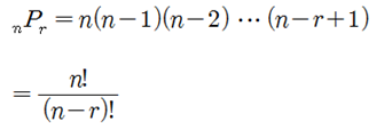

 이번 포스팅에서는 JS에서 재귀함수를 이용해 중복순열, 순열 마지막으로 조합을 구하는 방법을 알아보도록 하겠다.


#### 중복순열

- 중복순열이란 서로 **다른 N개 원소를 가진 배열에서 중복을 허락하고 r개를 일렬로 나열하는 수**를 말한다.

- 예시를 통해 알아보자.

  - [1, 2, 3]라는 배열에서, 중복을 허락하고 2개를 골라 일렬로 나열하는 방법을 모두 구해야 할 때, 나올 수 있는 가지수는 [1, 1], [1, 2], [1, 3], [2, 1], [2, 2], [2, 3], [3, 1], [3, 2], [3, 3]로 9가지이다.

  - N개 원소에서 r개를 중복을 허락하고 일렬로 나열하는 경우의 수는 N**r의 식으로 계산할 수 있다.

  - 중복 순열의 수식표현은 다음과 같다.

    


##### N까지의 자연수 중에서 중복을 허락하고 r개를 뽑는 중복순열 JS코드 구현

```javascript
function solution (N, r) {
    let ch = new Array(r).fill(0)
    function DFS(L) {
        if (L === r) {
            console.log(ch.join(" ").trim())
        }
        else {
            for (let i = 1; i <= N; i++) {
                ch[L] = i
                DFS(L + 1)
            }
        }
    }
    DFS(0)
}

solution(3, 2)
```


##### 특정 배열에서 r개를 뽑는 중복순열 코드 구현

```javascript
function solution (arr, r) {
    let ch = new Array(r).fill(0)
    function DFS(L) {
        if (L === r) {
            console.log(ch.join(" ").trim())
        }
        else {
            for (let i = 0; i < arr.length; i++) {
                ch[L] = arr[i]
                DFS(L + 1)
            }
        }
    }
    DFS(0)
}
let arr = [1, 3, 5]
solution(arr, 2)
```

----


#### 순열

- 순열이란 중복순열과 마찬가지로 다른 N개 원소를 가진 배열에서 r개를 선택하지만, **중복을 허락하지 않고** r개를 일렬로 나열하는 수를 말한다.

- 예시를 통해 알아보자.

  - 서로다른 3명 [상진, 홍준, 준호]이 있고, 이중에서 대표와 부대표를 뽑는 방법의 수를 생각해보자. 

  - 대표와 부대표는 다른 사람이 되어야 하고, 순서가 존재하기 때문에 **결과적으로는 서로 다른 3명중 2명을 골라 일렬로 배열하는 것**과 같다.

  - 경우의 수를 직접 구해보면, [상진, 홍준], [상진, 준호], [홍준, 상진] , [홍준, 준호],  [준호, 상진], [준호, 홍준] 6개이다.

  - 순열의 수식표현은 다음과 같다.

    


##### 3명중 2명을 뽑는 순열 코드 구현

```javascript
function solution(m, arr){ 
    let n = arr.length
    let ch = new Array(3).fill(0)
    let tmp = []
    
    function DFS(L) {
        if (L === m) {
            console.log(tmp.join(" ").trim())
        }
        else {
            for (let i = 0; i < n; i++) {
                if (ch[i] === 0) {
                    ch[i] = 1
                    tmp.push(arr[i])
                    DFS(L + 1)
                    ch[i] = 0
                    tmp.pop()
                }
            }
        }
    }
    DFS(0)
    return
}

let arr=["상진", "홍준", "준호"];
solution(2, arr)
```

