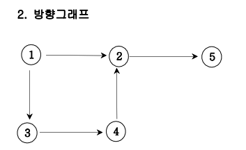

​	알고리즘 공부 할 때, 가장 난이도가 높다고 느껴졌던 그래프, 오늘은 무방향 그래프, 방향 그래프, 가중치 방향그래프에 대해 알아보고, 인접행렬로 그래프의 연결 관계를 표현하는 방법과 인접행렬을 구현하는 코드에 대해 알아보겠다.


### 1. 무방향 그래프

> 두 노드를 연결하는 간선에 방향이 없는 그래프이다. 양방향으로 통행이 가능하다.


위 그래프에서

노드 V = [1, 2, 3, 4, 5]로 총 5개이고,

간선 E = [[1, 2], [1, 3], [2, 4], [2,5], [3, 4]]로 간선 역시 총 5개이다.

노드 V와 간선 E에 대한 정보가 배열로 들어왔을 때, 이를 그래프의 연결관계를 이차원 배열로 나타낸 **인접행렬**로 표현하는 코드는 다음과 같다.

```js
// 노드 a에서 -> 노드b로 가는 간선이 존재하면 방향이 존재하지 않기 때문에 arr[a][b]와 arr[b][a]를 1, 아니면 0으로 표시
let V = [1, 2, 3, 4, 5], n = V.length;
let E = [[1, 2], [1, 3], [2, 4], [2,5], [3, 4]]
let Graph = Array.from({length: n + 1}, () => Array(n + 1).fill(0))
for (let [a, b] of E) {
    Graph[a][b] = 1
    Graph[b][a] = 1
}
console.log(Graph)
/*
[	    0  1  2  3  4  5
  0 : [ 0, 0, 0, 0, 0, 0 ],
  1 : [ 0, 0, 1, 1, 0, 0 ],
  2 : [ 0, 1, 0, 0, 1, 1 ],
  3 : [ 0, 1, 0, 0, 1, 0 ],
  4 : [ 0, 0, 1, 1, 0, 0 ],
  5 : [ 0, 0, 1, 0, 0, 0 ]
]
*/
```

무방향 그래프의 특징은, 양방향으로 이동이 가능하기 때문에 [0, 0] ~ [N, N]의 대각선을 기준으로 대칭을 보인다는 것이다. 


### 2. 방향 그래프

> 두 노드를 연결하는 간선에 방향이 있는 그래프이다. 다이어그래프라고도 불린다.



위 그래프에서

노드 V = [1, 2, 3, 4, 5]로 총 5개이고,

간선 E = [[1, 2], [1, 3], [2, 5], [3, 4], [4, 2]]로 간선 역시 총 5개이지만, 방향이 있으므로 무방향 그래프와는 인접행렬로 표현하는 코드가 다르다. 무방향 그래프가 대각선을 기준으로 대칭을 보인다면, 방향그래프는 반드시 대칭을 이루는 것은 아니다.

코드를 구현하면 다음과 같다.

```js
// 노드 a에서 -> 노드b로 가는 간선이 존재하면 arr[a][b] = 1, 아니면 0으로 표
let V = [1, 2, 3, 4, 5], n = V.length;
let E = [[1, 2], [1, 3], [2, 5], [3, 4], [4, 2]]
let Graph = Array.from({length: n + 1}, () => Array(n + 1).fill(0))
for (let [a, b] of E) {
    Graph[a][b] = 1
}
console.log(Graph)
/*
[	    0  1  2  3  4  5
  0 : [ 0, 0, 0, 0, 0, 0 ],
  1 : [ 0, 0, 1, 1, 0, 0 ],
  2 : [ 0, 0, 0, 0, 0, 1 ],
  3 : [ 0, 0, 0, 0, 1, 0 ],
  4 : [ 0, 0, 1, 0, 0, 0 ],
  5 : [ 0, 0, 0, 0, 0, 0 ]
]
*/
```


### 3. 가중치 방향 그래프

> 간선이 방향이 있으며, 값(value)이나 비용(cost)를 가지고 있는 경우를 말한다.


위 그래프에서

노드 V = [1, 2, 3, 4, 5]로 총 5개이고,

간선 E = [[1, 2], [1, 3], [2, 5], [3, 4], [4, 2]]로 간선 역시 총 5개이지만, 각 간선에 가중치가 붙어있으므로 이를 배열로 표현하면 arr = [[1, 2, 2], [1, 3, 4], [2, 5, 5], [3, 4, 5], [4, 2, 2]]이다.

가중치 방향 그래프를 인접행렬로 표현하는 코드를 구현하면 다음과 같다.

```js
let V = [1, 2, 3, 4, 5], n = V.length;
let arr = [[1, 2, 2], [1, 3, 4], [2, 5, 5], [3, 4, 5], [4, 2, 2]]
let Graph = Array.from({length: n + 1}, () => Array(n + 1).fill(0))
for (let [a, b, c] of E) {
    Graph[a][b] = c
}
console.log(Graph)
/*
[	    0  1  2  3  4  5
  0 : [ 0, 0, 0, 0, 0, 0 ],
  1 : [ 0, 0, 2, 4, 0, 0 ],
  2 : [ 0, 0, 0, 0, , 5 ],
  3 : [ 0, 0, 0, 0, 5, 0 ],
  4 : [ 0, 0, 2, 0, 0, 0 ],
  5 : [ 0, 0, 0, 0, 0, 0 ]
]
*/
```


다음 포스팅에서는 인접리스트를 구현하는 방법을 알아보겠다.
