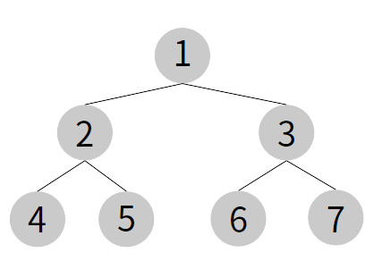

​	오늘은 두 노드 사이의 최단 경로, 혹은 임의의 경로를 찾고싶을 때 활용하는 너비우선탐색(BFS, Breadth-First Search)와 BFS의 개념에서 등장하는 큐에 대해서 알아보겠다.


### 너비 우선 탐색

> 루트 노드(혹은 다른 임의의 노드)에서 시작해서 인접한 노드를 먼저 탐색하는 방법
>
> 시작 정점으로부터 가까운 정점을 먼저 방문하고 멀리 떨어져 있는 정점을 나중에 방문하는 순회 방법인데, 그림을 통해 이해해보도록 하자.



다음과 같은 이진트리가 있다고 할 때, BFS로 탐색하는 순서는 다음과 같다.


> 0레벨에서 전체 탐색, 1레벨에서 전체 탐색, 2레벨에서 전체 탐색! 1 - 2 - 3 - 4 - 5 - 6 - 7


그리고 이런식으로 탐색을 하기 위해서는 `큐(Queue)`에 대해 미리 이해해야 한다.

#### 큐(Queue)

> 큐의 구조는 `선입선출`(First In, First Out)의 구조를 가지고 있다. 비슷한 개념인 스택이 막힌 박스와 같아 먼저 들어온 것이 가장 나중에 나가는 구조인 것(First In, Last Out) 과는 다르게 **큐는 먼저 들어온 것이 먼저 나가는 구조**다.


그럼 큐를 이용해 너비우선탐색을 하는 법을 알아보자.


우선 Queue에 0레벨인 1이 큐에 들어있다가 pop 되어 나와지면, 1과 연결된 노드들(1에서 갈 수 있는 노드들 2, 3)을 모두 Queue에 넣는다. 


이후 1레벨에서 가장 먼저 들어온 2가 pop 되어 나오면, 2와 연결된 노드들(4, 5)를 Queue에 넣는다.


3역시 pop 되어 나오면 3과 연결된 노드들(6, 7)를 Queue에 넣는다.

위와 같은 작업을 반복하다 보면, Queue에 있는 모든 노드들이 pop 될 것이고, pop 된 순서가 BFS를 실시한 결과이며, 다음 그림과 같다.


그림을 통해 Queue를 활용해 이진트리를 너비우선탐색하는 법을 알아봤으니, 이제 JS코드로 어떻게 구현해야 하는지 알아보자.

```js
function solution(){
    let answer = ""
    let Q = []
    Q.push(1)
    while (Q.length) {
        console.log(Q)
        let v = Q.shift()
        answer += v + " "
        for (let nv of [v * 2, v * 2 + 1]) {
            if (nv > 7) continue;
            queue.push(nv)
        }
    }
    return answer
}

console.log(solution());
```


