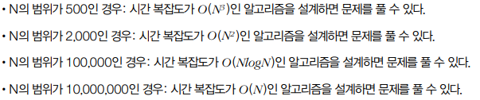
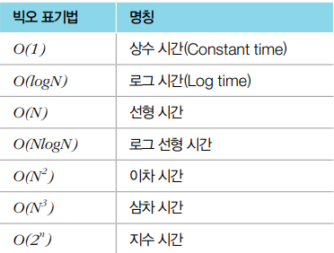

**어느덧 SSAFY 7기의 1년 생활도 마무리가 되어간다. 처음 알고리즘에 대해 배울 때, 가장 힘들었던 개념이 바로 `시간복잡도`였다. 이번 포스팅에서는 복잡도에 대해 나만의 언어로 정리하고 다시 알고리즘 공부를 시작해보려고 한다.**


## 시간복잡도

>  특정한 크기의 입력에 대하여 알고리즘이 얼마나 오래 걸리는지, 즉 입력값이 들어왔을 때 알고리즘이 출력값을 내보낼때까지의 시간을 의미한다. 알고리즘 문제를 풀 때 단순히 '복잡도'라고 하면 보통은 `시간복잡도`를 의미한다.

- ##### 빅오(Big-O) 표기법

  - 가장 빠르게 증가하는 항만을 고려하는 표기법

  - 예를 들어 N개의 데이터가 있고 모든 데이터값을 더한 결과를 출력하는 프로그램을 생각해보자 

    ```python
    array = [3, 5, 1, 2 ,4]
    sum = 0
    for i in array:
    	sum += i
    print(sum)
    
    #출력값 15
    ```

    위 예제에서 N의 값은 5이고 연산은 N의 값과 같이 5번 더하는 작업이 이루어진다.  물론 sum에 0을 대입하는 연산이나 출력을 하는 연산도 있지만 이는 N이 커짐에 따라 무시할 수 있을정도로 작아지기 때문에 예제코드에서 <u>가장 영향력이 큰 부분은 N에 비례하는 연상을 수행하는 반복문 부분이므로 시간복잡도를 O(*N*) 이라고 표기</u>한다.

    이해를 돕기 위해 몇가지 예제를 더 살펴보자

    ```python
    a = 5
    b = 7
    print(a + b)
    ```

     위 예제와 마찬가지로 a, b에 숫자를 대입하는 연산과 출력함수를 무시하고 보면 이 소스코드의 연산 횟수는 1이다. 따라서 <u>시간복잡도는 O(*1*)</u>

    ```python
    array = [3, 5, 1, 2, 4]
    for i in array:
    	for j in array:
            temp = i * j
            print(temp)
    ```

     간단한 2중반복문 이기 때문에 N x N 만큼의 연산이 필요하다는 것을 유추할 수 있다. 따라서 <u>시간복잡도는 O(N<sup>2</sup>)</u>. **다만 소스코드가 내부적으로 다른 함수까지 호출 한다면 해당 함수의 시간 복잡도까지 고려**해야 하므로, 코드를 정확히 분석한 뒤에 시간복잡도를 계산해야 한다는 점을 기억하자.

    

     나는 아직 그래본적은 없지만, 실제로 알고리즘 문제에 익숙한 사람들은 문제의 조건을 확인하고 사용할 수 있는 알고리즘을 좁혀나가는 방식을 사용한단다. 나도 그럴날이 오기를 기대하면서 문제풀때의 몇가지 예시를 소개하겠다.

    

    

    다음은 시간복잡도에 따른 명칭이다. 눈으로만 읽어보자.

  

  ​	

시간복잡도에 대해 간단하게 알아보았다. 혹시 추가로 알게되는 사항이 있거나 궁금한 사항들은 추가로 업로드 하겠다.
