 내 블로그를 구경하던 잘 아는 동생이 왜 댓글 기능이 없냐고 물어봤다^ㅡ^. 그래서 오늘은 깃 블로그 게시물에 댓글을 남길 수 있도록 도와주는 **Disqus서비스**를 등록하는 방법을 알아보겠다.

 Disqus는 GitHub Pages에서는 지원하지 않는 **댓글 기능을 지원해주는 서비스**라고 생각하면 되겠다. 네이버 블로그, 티스토리 등은 댓글 기능을 직접 지원하기 때문에 한국에서는 인지도가 낮은 편이지만, 나처럼 깃허브 블로그 테마(이 블로그는 지킬, jekyll)를  사용해서 <u>댓글기능을 직접 커스텀하기 힘든 사람들</u>에겐 상당히 유용할 것 같다.

### 1. Disqus 가입하기

먼저 [Disqus](https://disqus.com/)에 방문해서 가입을 진행한다. 계정이 생겼다면 로그인을 해서 깃 블로그에 댓글 서비스를 등록해 보는 절차를 진행해 보자.

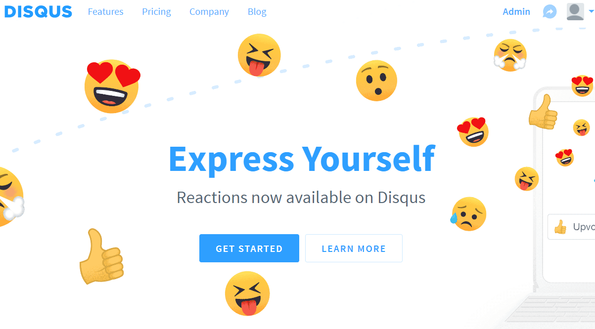

**GET STARTED 버튼**을 클릭해서 서비스 신청을 시작하면, 다음과 같은 화면이 나온다.

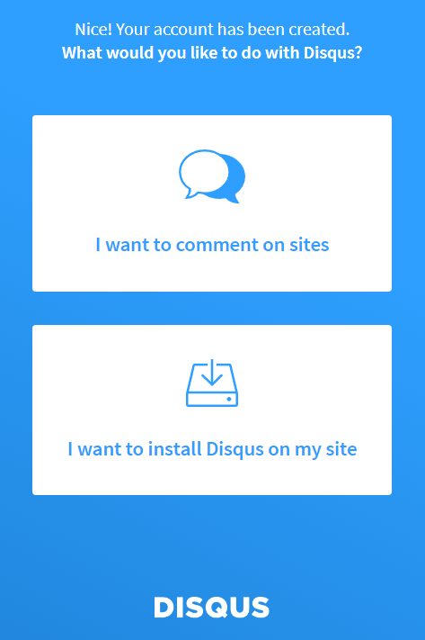

깃 블로그에 Disqus 댓글 기능을 설치할 것이기 때문에 **I want to install Disqus on my site**를 선택!!

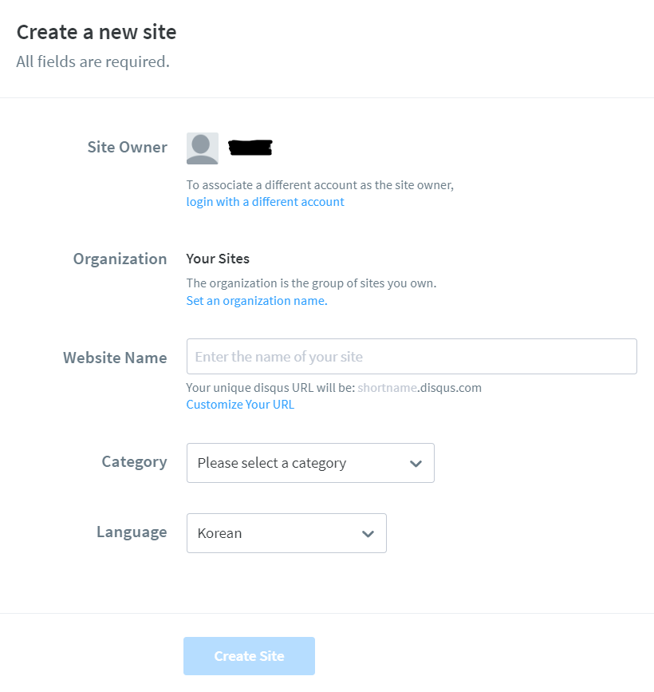

Disqus에 댓글 기능을 연결할 사이트 정보를 기입한다. 개인이 운영하는 깃 블로그이기 때문에 Organization 설정은 불필요 하고, Website Name은 에 본인이 구분할 수 있는 사이트명을 기재한다. Disqus는 한 계정에 여러개의 사이트를 등록할 수 있기 때문에 고유한 사이트 이름으로 이를 구분하는데, 사실 자신이 잘 구별하면 되기 때문에 중복되지만 않으면 크게 의미는 없다.

 Website Name 밑으로 나오는 unique disqus URL은 **disqus-shortname**이 된다. 이 **shortname**을 블로그 설정에도 적용해야 하니 잘 적어두자. Category는 본인의 블로그 성격에 맞게 설정해주고, 언어는 한글로 바꾼후에 Create Site을 클릭한다.

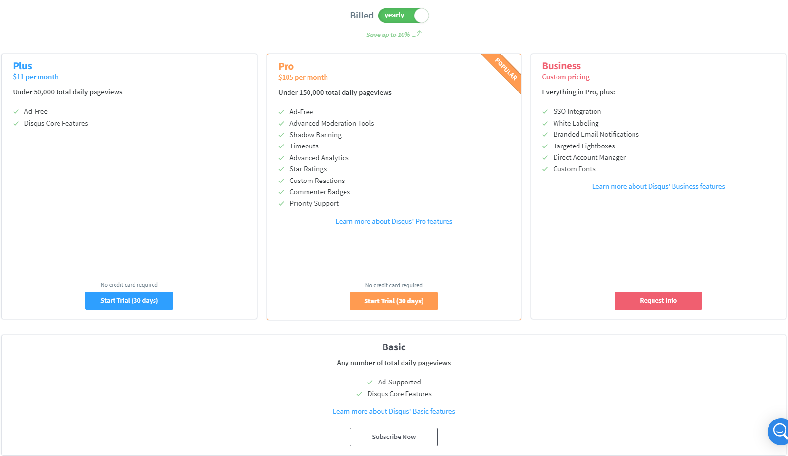

이후에는 계정 등급을 선택할 수 있는데, 돈을 써서 다른 등급을 선택할게 아니라면 무료 등급인 Basic을 선택하고 넘어가면 된다.

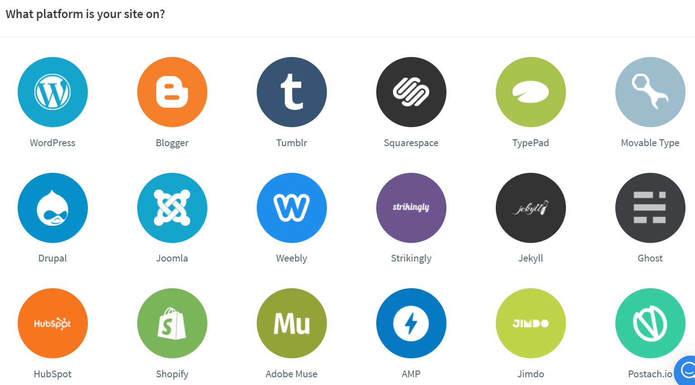

다음으로는 사용하고 있는 플랫폼을 고르라는 페이지가 나온다. 각자에 맞는 플랫폼을 선택하면 되고, 나는 지킬을 사용하고 있으니 지킬을 선택하겠다.

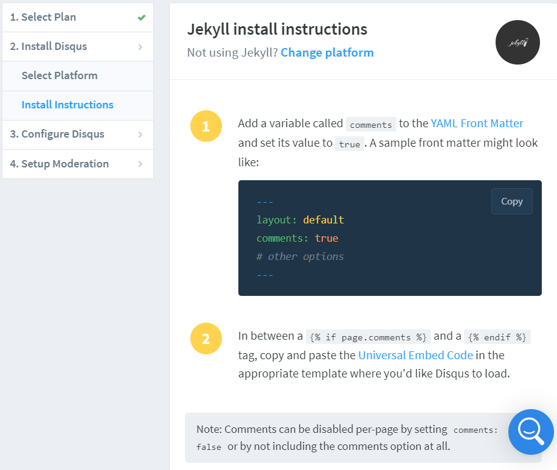

그럼 이런 페이지가 나오는데, install intructions는 그냥 눈으로 쭉 읽어보고 3번 Configure Disqus를 클릭해준다.

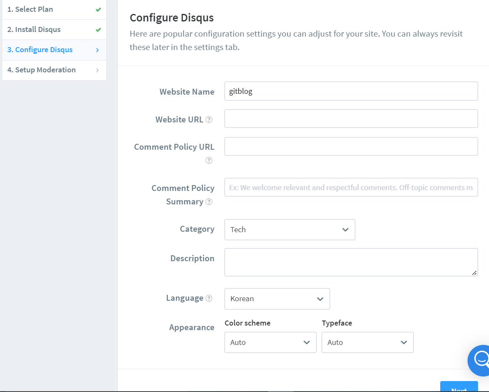

Disqus 설정 화면이다. Website URL 항목은 블로그의 URL을 정확히 적어준다. 나머지 항목들은 중요치 않으니 읽어보고 필요한 내용은 설정하자.

사이트 생성 과정이 완료되었다. 설정 내용이 맘에 안들거나 다시 확인할 필요가 있으면 세팅에서 사이트 관리를 선택해서 다시 수정할 수 있다. 사이트를 사용하는게 다소 어려울수도 있는데, 잘 모르겠으면 일단 이것저것 눌러보면서 사이트를 익혀보자.

### 2. _config.yml에 Disqus 정보 기입하기

지킬 테마를 사용했다면, 분명 _config.tml 파일이 있을 것이다. 

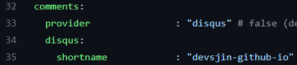

다음과 같이 **provider에 "disqus"를 기입**해주고, **shortname에 위에서 이야기 했던 자신만의 고유 shortname**을 적어주면 된다.

*만약 shortname이 뭔지 모르겠다면*

1. ***Disqus 홈 화면에서 Admin 클릭***
2. ***상단바의 Settings 클릭***
3. ***왼쪽 사이드바에서 General 에 들어가서 Shortname 확인***

이렇게 하면 이제 지킬테마에서 Disqus 서비스를 사용할 준비가 완료된 것이다.

### 3. 게시물 댓글 기능 디폴트 값을 true로

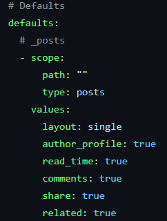

Disqus 서비스 등록이 성공적으로 이뤄졌다고 해도 아직은 게시물에 댓글을 작성하는 기능은 없을 것이다. 아직 댓글이 필요한 게시물을 지정하지 않았기 때문이다. 
여기서는 **default 설정에 true 설정을 했으니 모든 포스트 글에는 기본적으로 Disqus 댓글이 모두 적용**된다. 만약 특정 포스팅에 댓글 기능을 끄고 싶다면, 해당 글의 맨 위 부분에 들어가는 comments를 false로 설정하면 되겠다.

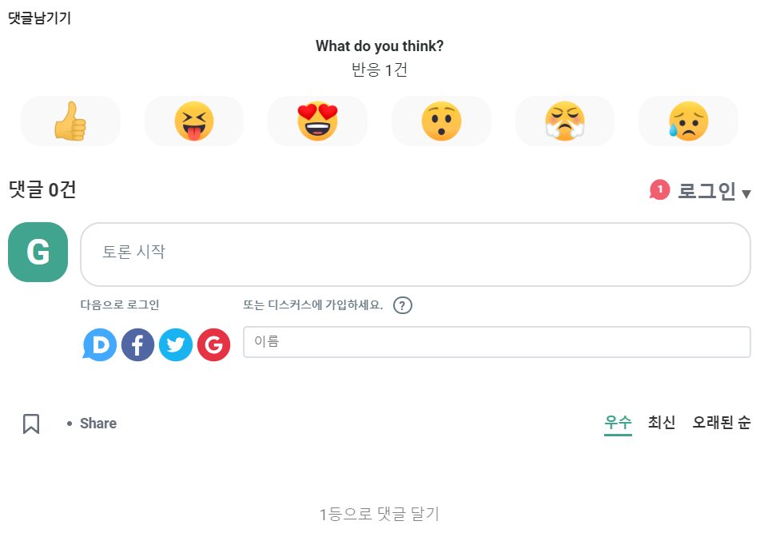

Disqus 댓글 기능이 잘 적용된 모습이다. 

### 마지막. 반응 이모지 없애기 및 게스트로 댓글 남기기

반응이모지는 개인에 따라 호불호가 많이 갈릴 것 같다. 나는 처음에는 나쁘지 않아 보였는데 이모지가 너무 커서 오히려 댓글창을 눈에 띄지 않게 만드는 것 같아서 반응 이모지 기능을 없애려고 한다. 

아까 Shortname을 언급하면서 말했던 Admin 페이지에 들어가면

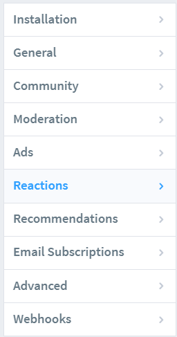

다음과 같이 사이드바에 **Reactions 탭**이 있다. 해당 페이지에서 밑으로 쭉 내리면 

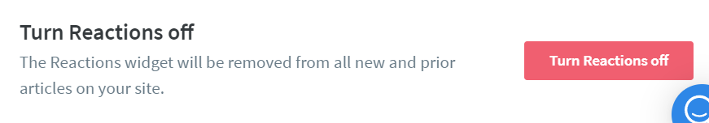

여기서 반응 이모지를 꺼주면 되겠다.

마지막으로 게스트 댓글남기기 기능은 위 사진에서 Reactions 두번째 윗칸 **Moderation 탭**에 들어가면

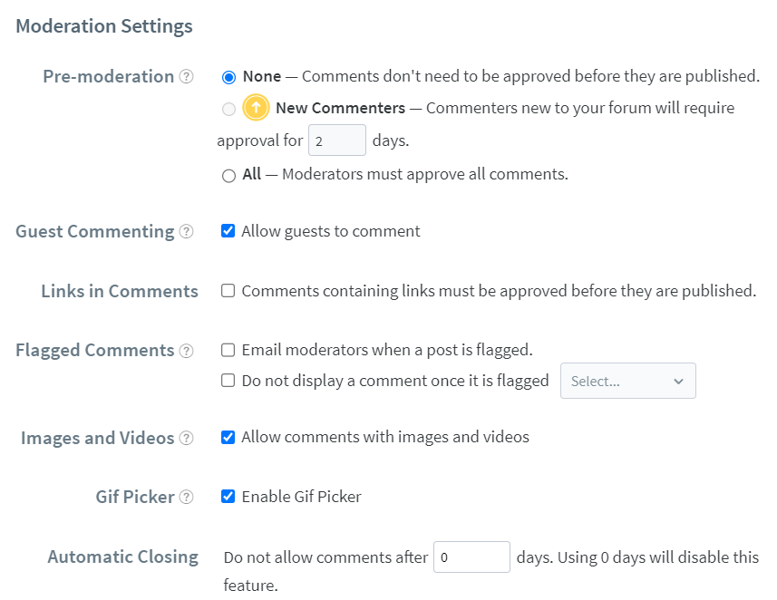

다음처럼 Moderation Settings를 보게된다. 여기서 **Guest Commenting을 선택**해주면 로그인하지 않은 게스트들도 댓글을을 남길 수 있게 된다. 