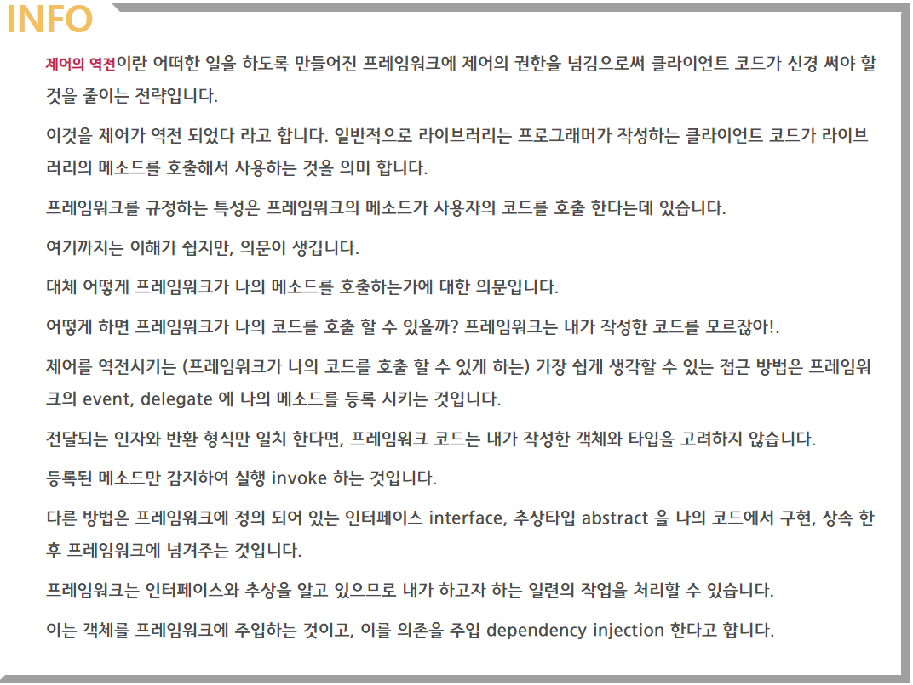

​	싸피에서 직무 면접을 연습하던 중 이런 질문을 받았다. 

​	**"프레임워크와 라이브러리의 차이를 설명할 수 있나요?"**

​	"......프레임워크는 Django 같은.. 라이브러리는....리액트..."

 프로젝트를 진행하면서 사용한 기술들이 프레임워크, 라이브러리인데 제대로 대답하지 못하는 나를 보며, 개발자로의 갈길은 아직 멀었다는 생각이 들었다. 충분히 직무면접에 나올 법한 질문인데, 너무 안일했던것 같다. 그래서 이제부터라도 천천히 개념적인 부분들을 공부해 다음에 비슷한 질문이 왔을 때 자신있게 대답하고 싶다.

## **:computer: 간단한 정의**

#### **:ship: 프레임워크**

​	프레임워크는 원하는 **기능 구현에 집중하여 개발할 수 있도록 일정한 형태와 필요한 기능을 갖춘 뼈대나 기반 구조**를 의미한다. 애플리케이션 개발 시 필수적인 코드, 알고리즘, DB 연동과 같은 기능들을 위해 어느 정도 뼈대를 제공하고, 사용자는 이러한 뼈대 위에서 코드를 작성하여 애플리케이션을 개발하게 된다. 이때, 사용자는 프레임워크가 정해준 방식대로 클래서, 매서드들을 구현하면 된다. 

 소프트웨어에서의 프레임워크는 '소프트웨어의 특정 문제를 해결하기 위해서 **상호 협력하는 클래스와 인터페이스의 집합**' 이라 할 수 있으며, 완성된 어플리케이션이 아닌 프로그래머가 완성시키는 작업을 해야한다. 

 비유적으로 표현하자면 프레임워크는 차, 비행기, 배같은 이미 만들어진 탈 것 이다. **사람이 직접 타서 시동을 걸고, 기어 넣고, 운전하고 조종**하거나 해야한다. 또한, **만들어진 목적이 있기 때문에 그 목적에 맞게 정해진 곳으로, 정해진 방식**으로 다녀야 한다.

 라이브러리와는 달리 프레임워크는 이미 프로그래밍할 규칙이 정해져 있다. 
 예를 들어, 설정파일로 사용되는 XML에 어떤 태그를 써야하며, 어떤 함수를 추가적으로 작성해야하고, 소스 파일을 어느 위치에 넣어야하며, DB와 연동하기 위해 무엇을 써넣어야 하는지 정해져 있다. 
 보통 이런 대부분의 작업은 프레임워크가 하고자 하는 일에 비하면 아주 작은 일이며, 사람은 일부분만 조정함으로써 목적을 달성할 수 있다. 

##### 프레임워크 예시

- Java 서버 개발에 사용되는 Spring    
- Python 서버 개발에 사용되는 Django, Flask  
- 안드로이드 앱 개발에 사용되는 Android   
- 아이폰 앱 개발에 사용되는 Cocoa Touch   
- 웹 개발에 사용되는 Angular, Vue.js, Express.js 등  
- 자바 기반의 JSP를 위한 프레임 워크 Struts
- 루비로 작성된 MVC패턴을 이용하는 Ruby on Rails  

#### **📚 라이브러리**

 **소프트웨어를 개발할 때 필요한 특정 기능을 모아둔 코드, 함수들의 집합**이며 코드 작성 시 단순 활용 가능한 도구들을 의미한다. 보통 개발자가 만든 클래스에서 직접 호출하여 사용하고, 클래스들의 나열로 필요한 클래스를 불러서 사용하는 방식을 취한다.

 비유적으로 표현하자면, 라이브러리는 톱, 망치, 삽과 같은 연장이다.
 사람이 필요에 따라 직접 도구들을 사용해 필요한 곳에 쓰면 된다. 물론 원하는 것을 만들어낼 수 있다면 파야할 곳을 망치로 두드려도 되고, 썰어야 할 곳을 삽으로 내려칠수도 있을 것이다.

##### 라이브러리 예시

- Python pip로 설치한 패키지/모듈 (tensorflow, pandas, beautifulsoup 등등)
- C++의 표준 템플릿 라이브러리 (STL)
- Node.js에서 npm으로 설치한 모듈 
- HTML의 클라이언트 사이드 조작을 단순화하는 JQuery
- 웹에서 사용자 인터페이스 개발에 사용되는 React.js

## **👀 마무리, 프레임워크 vs 라이브러리**

> 프레임워크와 라이브러리의 가장 큰 차이점은 "**제어 흐름**"의 권한이 어디에 있는가 이다.

라이브러리를 사용할 때 사용자는 애플리케이션 코드의 흐름을 **직접 제어**해야 한다.
개발 시 필요한 기능이 있을 경우 능동적으로 라이브러리를 호출하여 사용하거나 기존에 구성된 함수나 코드를 가져다 써야 한다. 

반면 프레임워크는 애플리케이션의 코드가 프레임워크에 의해 사용된다.
애플리케이션 코드는 프레임워크가 짜 놓은 틀에서 **수동적으로 동작**하기 때문에 제어의 흐름은 프레임워크가 가지고 있고 사용자가 그 안에 필요한 코드를 작성하게 됩니다.

여기서 **제어의 역전(IoC, Inversion of Control)**이란,
어떠한 일을 하도록 만들어진 Framework에 Control 권한을 위임하는 것을 의미하는데, 
간단히 말해 프로그램의 제어 흐름 구조가 뒤바뀐 것을 뜻한다. 

라이브러리의 경우 애플리케이션의 흐름을 사용자가 직접 제어해야 하지만 프레임워크의 경우 코드를 연결할 수 있는 위치를 제공하고 필요에 따라 사용자가 연결한 코드를 호출하는 제어 흐름 권한을 가지고 있다.

[출처] [https://webclub.tistory.com/458](https://webclub.tistory.com/458), [https://cocoon1787.tistory.com/745](https://cocoon1787.tistory.com/745)

