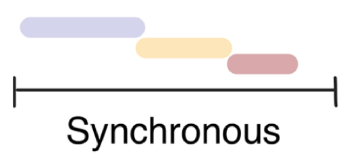
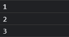
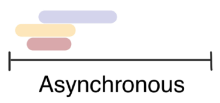
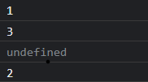
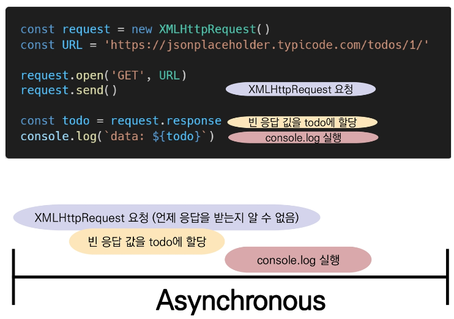

 오늘은 이전[ Ajax 포스팅](https://devsjin.github.io/categories/interview/Ajax)에서 나왔던 개념인 **동기 & 비동기**에 대한 글을 작성해 보겠다. 


### 동기(Synchronous)

> Synchronous는 해석하면 "동시에 일어나는" 정도인데, 말 그대로 요청과 결과가 동시에 일어난다는 약속이다. 요청을 하면 시간이 얼마가 걸리던지 요청한 자리에서 결과가 주어져야 한다.

- 요청을 보낸 후 응답을 받아야만 다음 동작이 이루어짐(**blocking**)

- **순차적, 직렬적**인 Task를 수행한다.

  

##### 동기 예시)

```javascript
console.log('1')
console.log('2')
console.log('3')
```

위 코드의 결과값으로 1, 2, 3이 순차적으로 찍힐 것이 예상된다.



예상대로 1, 2, 3이 순차적으로 출력이 된 모습이다. 
이처럼 코드가 위에서부터 순서대로 하나가 끝나면 다음 코드가 실행되는 방식을 동기적 처리 (Synchronous)라고 한다.

----

### 비동기(Asynchronous)

> Asynchronous는 "동시에 일어나지 않는"다는 의미 인데, 요청과 결과가 동시에 일어나지 않아도 된다는 약속이다. 요청과 응답이 서로 다른 시간에 존재하기 때문에 요청내용에 대해 지금 바로 혹은 당장 응답하지 않아도 된다.

- 요청을 보낸 후 응답을 기다리지 않고 다음 동작이 이루어짐(**non-blocking**)
- **병렬적** Task를 수행한다.



##### 비동기 예시1)

비동기 메소드인 setTimeout()를 활용해 보겠다.

```javascript
console.log('1')
setTime(() => {
    console.log('2')
}, 0)
console.log('3')
```

setTimeout()메소드의 첫번째 인자는 콜백함수이고 두번째 인자는 지연시간이다. 비동기의 이해를 돕기 위해 일부러 지연시간을 0으로 설정했다. 지연시간이 0이기 때문에, 단순히 생각하면 1, 2, 3이 출력될 것이라고 예상할 수 있다. 그러나,



결과값은 1, 3, 2의 순서로 찍혔다. 왜 이런 걸까?
앞에서도 말했지만 setTimeout()이 비동기로 처리되기 때문에 요청에 대한 응답값을 **기다려주지 않는다.**
**비동기적 코드의 실행 결과는 동기적 코드가 전부 실행 되고나서 값을 반환한다.**


##### 비동기 예시2)

지난 [Ajax포스팅에서 했던 실습내용](https://devsjin.github.io/categories/interview/Ajax#%EC%8B%A4%EC%8A%B5)을 예시로 한번 더 가져왔다. 



위 코드에서는 request.send() 요청이 비동기 요청인데, 응답 받기를 **기다려주지 않고** 동기적 코드인 5,6번째 줄의 코드가 실행이 되었기 때문에 todo에는 아무런 값도 할당되어 있지 않았다.


---

### 그렇다면 왜 JS는 기다려주지 않는 방식으로 동작하는가?

> JS는 Non-Blocking이며, single threaded 이기 때문이다.

- JS는 컴퓨터가 여러 개의 CPU를 가지고 있어도, main thread라 불리는 단일 스레드에서만 작업을 수행한다.
- 즉 JS 이벤트를 처리하는 **Call Stack**이 하나인 언어라는 의미이다.
  - Call Stack란 요청이 들어올 때 마다 해당 요청을 순차적으로 처리하는 Stack 형태의 자료구조를 말한다.
- 이 문제를  해결하기 위해 JS는
  1. 즉시 처리하지 못하는 이벤트들은 **Web API**로 보내서 처리하도록 하고
     - JS 엔진이 아닌 브라우저 영역에서 제공하는 API이다.
     - **setTimeout(), Dom events 그리고 Ajax로 데이터를 가져오는 시간이 소요되는 일들을 처리하는 곳**이다.
  2. 처리된 이벤트들은 **처리된 순서대로** 대기실(**Task Queue**)에 줄을 세워 놓고
     - **비동기 처리 된 callback 함수가 대기하는 Queue 형태의 자료구조**를 **Task Queue**라고 한다.
     - main thread가 끝난 후 실행되어 후속 JS 코드가 차단되는 것을 방지한다.
  3. Call Stack이 비면 담당자(**Event Loop**)가 대기 줄에서 가장 오래된 (제일 앞의) 이벤트를 Call Stack로 보낸다.

실제로 코드가 작동하는 순서를 눈으로 확인하고 싶다면 [JS Event Loop visualizer](https://latentflip.com/loupe) 에서 확인 가능하다.

##### [참고] Treads(스레드)

- 프로그램이 작업을 완료하기 위해 사용할 수 있는 단일 프로세스이다.

- 각 스레드는 한 번에 하나의 작업만 수행할 수 있다.

- Task A -> Task B -> Task C

  - 다음 작업을 시작하려면 반드시 앞의 작업이 완료되어야 한다.
  - 컴퓨터 CPU는 여러 코어를 가지고 있기 때문에 한 번에 여러가지 일을 처리할 수 있다.

  

---

### 순차적으로 비동기를 처리하는 방법은?

- JS의 Event Loop를 살펴보면, Web API로 들어오는 순서는 중요하지 않고, 어떤 이벤트가 먼저 처리되느냐가 중요했다. 즉 작성한 코드와는 별개로 실행 순서가 불명확 했다.

- 이를 해결하기 위해 순차적인 비동기 처리를 위한 2가지 작성 방식
  1. Async callbacks
  2. promise-style
     - Modenr Web APIs에서의 새로운 코드 스타일
     - XMLHttpRequest 객체를 사용하는 구조보다 조금 더 현대적인 버전


인데, Promise 객체와 axios에 대해서는 이후 포스팅에서 알아보겠다.
