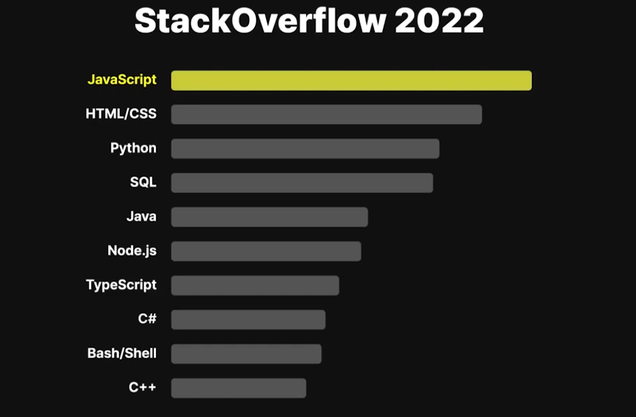

 1년 동안 싸피에서 공부하면서 느낀건데, 나는 어떤 언어를 배우던 간에 개념적인 부분이 정말 부족하다. JS도 그 중 하나였다. 그냥 쓰라고 해서 쓰고, 배우라고 해서 배우긴 했는데, 그래서 JS는 정확히 어떤 언어인가? 라고 물어보면 대답하기 힘들 것 같다. 

오늘부터 자바스크립트 공부도 다시할 겸 개념부터 확실히! 정리할 예정이다.

### 자바스크립트란 어떤 언어인가요?

올해 인기있던 기술스택을 살펴보면 어느 조사에서든 자바스크립트의 인기는 자바, 파이썬과 더불어 최상위권에 위치해 있다. 

그렇담 무엇이 자바스크립트를 이토록 인기 있게 만든것이고, 자바스크립트를 활용하면 어떤 일들을 할 수 있는지 알아보겠다.

##### 자바스크립트의 용도

자바스크립트는 원래 **웹사이트에서 활용될 목적**으로 만들어졌다.

웹페이지를 만들때 기본적으로,

1. `HTML`은 웹페이지의 각종 요소들을 '**갖다 놓고**'

2. `CSS`는 이 요소들을 원하는 비주얼로 '**꾸며**' 준다.
3. `JS`는 브라우저 화면 요소들을 조작하여 동적으로 만들 수 있는 유일한 언어!

 HTML, CSS는 각각 **기능이 제한된** '마크업' 언어, '스타일' 언어 이기 때문에 이 두가지만 가지고서는 웹사이트에 요소를 배치하고, 꾸미는 정도밖에 하지 못한다. 

 즉, 화면에 버튼 요소를 위치시키고, 이쁘게 꾸며놓아도 **눌렀을때 아무런 기능을 하지 못한다**. 

 이런 요소들이 기능을 부여하려면, 마크업 언어나 스타일 언어보다 많은 일들을 할 수 있는 프로그래밍 언어인 `자바스크립트`를 사용해야 하는 것이다. 버튼 클릭에 반응하게 하고, 특정한 기능을 부여하고, 기능에 따라 바뀌는 화면을 사용자에게 보여주는 일을 하는 것은 자바스크립트 프로그래밍으로 할 수 있다.

 쨋든 JS는 위와 같은 용도로 개발된 언어이기 때문에 JS의 원래 무대는 우리가 웹 서핑을 할때 사용하는 '브라우저'에 한정되어 있었다. 사용자가 주소를 입력해 웹사이트에 접속하면 HTML, CSS 코드와 함께 사용자의 컴퓨터로 다운로드 되어서 브라우저들에 의해 실행되는 것이 JS코드가 할 수 있는 일의 전부였다. 때문에 이때까지만 해도 JS는 프론트엔드 개발자들의 전유물이었다. 

##### 자바스크립트의 진화

 그러다가 2009년, 라이언 달이라는 개발자가 크롬에서 사용되는 자바스크립트 실행 프로그램의 코어, 즉 '엔진'을 브라우저 밖으로 추출해내서 `Node.js`를 만들어 낸다. 

 기존의 브라우저에서만 쓸 수 있던 JS를 이제 내 컴퓨터 어디서든 원하는대로 쓸 수 있게 된 것이다! 이 일을 계기로 프론트엔드에 국한되어 있던 JS의 활동영역은 서버, 모바일, 머신러닝 등 여러 프로그램으로 확장되었다. 

##### 자바스크립트의 특징

 코드만 보면 얼핏 C나 자바등의 언어랑 비슷해 보인다. 하지만 생성자 함수, 프로토타입, 동적 바인딩, 클로져, 일급 객체, 이벤트 루프 등등...파고 들어갈 수록 복잡한 개념들을 공부하다 보면 정말 쉽지 않은 언어라는 사실을 알 수 있다.

JS는 파이썬이나 루비처럼 '**인터프리터 언어**'이다. C나 자바, Go등의 '컴파일 언어'와는 달리 따로 포장하거나 가공하는 컴파일 과정을 거치지 않는다. 때문에 개발과정이 비교적 빠르고 유연하나 버그가 덜 걸러지고 실행이 조금은 느리다는 단점이 있다. 

또한 JS는 **동적 타입을 가진 언어**이다 특정 값이 할당된 변수에, **그와 다른 자료형의 값을** 넣는 것이 가능하다. 다만 그만큼 자료형 관련 오류들에 취약할수밖에 없다.