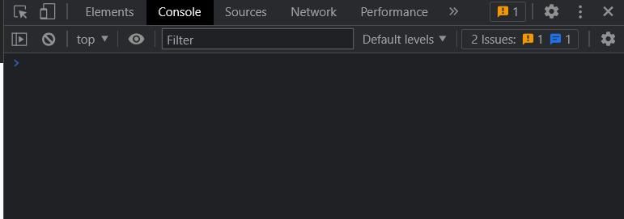
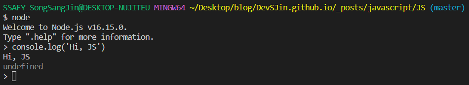
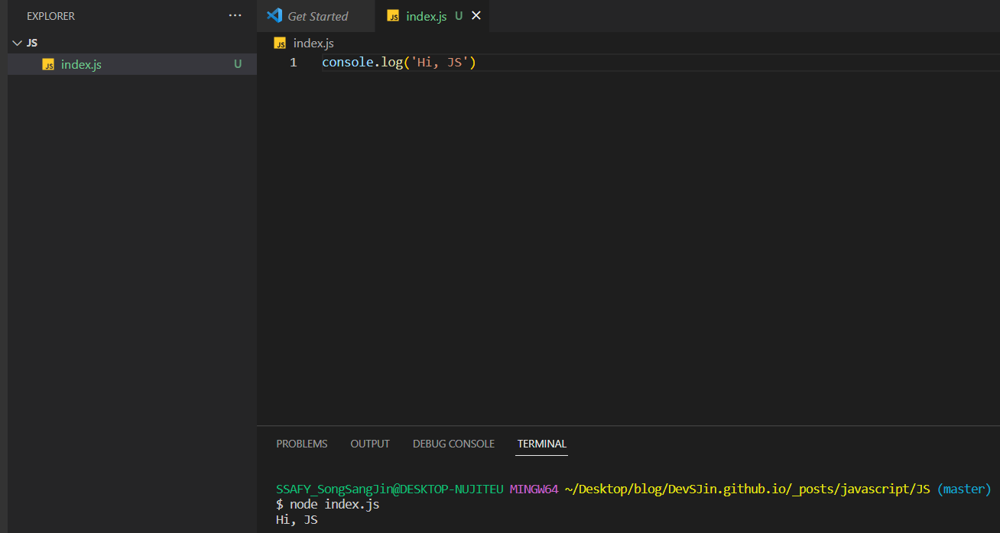

 오늘은 자바스크립트 실습을 위한 런타임환경 및 콘솔 활용법에 대해 알아보겠다.

#### 자바스크립트 `런타임 환경`(*runtime environment*)

> 자바스크립트 코드를 실행할 수 있는 소프트웨어

- 컴퓨터가 회사라면, **자바스크립트란 언어를 구사하는 직원**이다.
- 대표적으로 브라우저와 Node.js 등이 있음
- 콘솔은 **자바스크립트의 기능이 아닌 런타임 환경의 기능**이다.

##### 1. 브라우저 콘솔 사용하기

- 개발자 도구 열기
  - 윈도우: `Ctrl` + `Shift` + `i`
  - 맥: `command` + `option` + `i`
- `Console` 탭 열기

##### 2. Node.js 활용하기

> 자바스크립트를 컴퓨터에서 실행할 수 있는 환경
>
> 원활한 사용을 위해 우선적으로 VS Code, Git, Node,js 설치!!

- [VScode 설치](https://code.visualstudio.com/)
- [Node.js 설치](https://nodejs.org/)
- [Git 설치](https://git-scm.com/downloads)
  - Git 설치후 VS Code의 기본 터미널을 Git Bash로 설정하기
    - VS Code에서 `Ctrl` + `Shift` + `P`
    - `Select Default Profile` 검색하여 선택
    - **Git Bash** 선택
    - 터미널에서 **+**로 새 창을 열어서 기본으로 Git Bash가 설정된 것 확인

설치가 완료됐다면, 💻 Node.js의 **REPL** 사용해보기

- **R**ead **E**val **P**rint **L**oop
- `node`로 자바스크립트 명령 입력 모드 진입 후 입력
- 모드 종료: `ctrl` + `c` 2회

혹은 Node.js 환경에서 .js 파일로 바로 실행하기

- VS Code에서 프로젝트 폴더 열람
- `(원하는 파일명).js` 파일 생성
- 코드 입력 후 저장(저장 필수!!!! 저장 안하고 왜 안나오지? 하는 경우가 생각보다 많다.)
- `node (파일명)`로 실행

혹시라도 VS Code 확장프로그램 중에 Code Runner을 사용중인 사람은

- 윈도우: `Ctrl + Alt + N`
- 맥: `control + option + N`

위 명령어를 통해 바로 해당 파일을 실행할 수 있다.