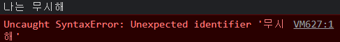
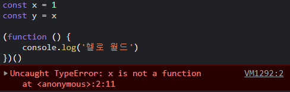

 이번 포스팅에서는 JS에서 주석을 사용하는 방법과 세미콜론 사용에 대해 알아보겠다.

#### 주석(comment)

> 주석은 설명, 필기, 제안이나 주의할 점 등을 자바스크립트 코드에 넣을 때 사용한다. 이는 코드를 더 쉽게 읽고 이해할 수 있게 도와준다. 또한 특정 코드가 실행되지 않도록 막아주기도 하기 때문에 사용에 따라 유용한 디버깅 도구라고도 할 수 있다.

- 코드를 작성한 사람이 추후에 해당 코드를 보게 될 사람을 위해 좀 더 이해하기 쉽도록 하기 위한 목적으로 작성
- 코드에 대한 설명, 추후 진행해야 할 사항 등을 적는다.


##### 자바스크립트에서 주석을 다는 법

- 한 줄 주석은 코드 앞에 //를 입력하거나, 다음의 단축키를 사용한다
  - 윈도우: `ctrl` + `/`
  - 맥: `command` + `/`

다음과 같은 코드를 입력해보자.

```javascript
console.log('Hi, JS')
// 나는 무시해
// console.log('나는 무시해')
console.log('Hello, Wolrd!')
```


// 가 표시되어있는 줄은 주석처리가 되어 무시가 되는 것을 볼 수 있다. 그렇다면

```js
나는 무시해
```

를 그냥 입력하면 어떻게 될까?



자바스크립트 코드로 인식하지 못하기 때문에 당연히 에러가 발생한다^__^


- 여러 줄에 주석을 달때는 /**/를 사용하거나, 여러 줄이 선택된 상태에서 주석 단축키를 누르면 된다.

```javascript
/* 주석은 이와 같이 여러 줄에 걸쳐
작성할 수도 있다.
장문의 주석을 달거나

console.log('안찍힘');
console.log('이것도 안 찍힘');

위와 같이
코드의 일부를 주석처리하여
비활성화는 등의 목적으로 사용된다. */

console.log('찍힘');

console.log('찍힘');
```


##### 💡 주석은 가능한 많이 달지 않는 것이 깔끔하고 좋다고 생각한다.

- 주석이 많이 필요한 코드 : 이해하기 어려운 코드,,
- 주석 없이도 알아보기 쉬운 코드를 짜도록 노력하자!!


#### 자바스크립트와 세미콜론 ( **;** )

> 세미콜론의 필요성에 관해서는 다양한 의견이 존재한다. 굳이 세미콜론을 사용하지 않아도 지금 자바스크립트 문법에서는 ASI로 인해 코드가 작동하는데 큰 문제가 없기 때문인데, 세미콜론을 안쓰는 것을 선호하는 사람들이 유의해야할 세미콜론 사용시기에 대해 알아보자.

##### 개발자의 세미콜론 작성과 관계가 있는 3가지 경우

1. statement 두개가 나란히 붙어있는 경우
   - 사이에 세미콜론을 넣어줘야 한다.


2. **IIFE**(코드의 다른 곳에 영향을 끼치지 않고 깔끔하게 할 일 하고 사라지는 자바스크립트의 코딩 기법)

   - ASI는 줄바꿈이 되어도, 다음 줄의 시작이 여는 괄호라면 세미콜론을 붙이지 않는다. 

   - 따라서, IIFE 코드 앞쪽에 세미콜론을 넣어줘야 한다.




3. 코드에서 즉성으로 배열을 만들고 forEach를 돌리는 경우
   - 이 경우에도 ASI가 x뒤에 세미콜론을 붙여주지 않는다.
   - 위의 경우와 마찬가지로 배열 앞에 세미콜론을 붙여준다.


