 이번 포스팅에서는 JS에서 데이터를 담을때 사용하는 주머니라고 할 수 있는 `변수와 상수`에 대해 알아보겠다.


### 변수(*variable*)

- 담긴 값이 바뀔 수 있는 주머니, `let`을 사용한다.
- `재할당`이 가능하다. `재선언`은 불가능하다.

##### 1. 변수를 먼저 선언하고, 그 뒤에 값을 넣는다.

변수를 선언하면 undefined가 먼저 할당되고, 이후 다른 값이 재할당 된다.

```javascript
let x;
// x라는 변수 선언
console.log(x)

x = 1;
// x라는 값에 1을 할당
console.log(x);
```

위 코드를 실행해보면, 

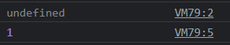

다음과 같은 값을 확인할 수 있는데,

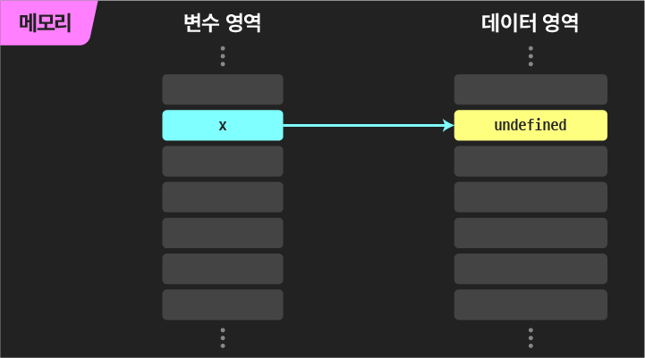

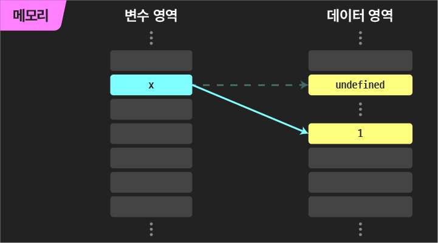

위 사진처럼 처음에는 아직 값이 선언(O) 할당(X) 상태이기 때문에 처음에는 undefined(데이터 영역에 저장되어 있는 하나의 값)가 찍히고, 이후에 1이 할당된 후에는 1이 찍히는 모습을 볼 수 있다.

할당을 하면, undefined라는 값 자체가 1로 변하는 것이 아니라, 데이터 영역에 할당한 값을 저장하고 해당 값으로 가리키는 방향이 바뀌는 것이다.

##### 2. 변수 선언과 동시에 값을 할당하기

```javascript
let x = 1;
console.log(x)
```

변수를 선언하면서 동시에 값을 넣는 것이 가능하다. 메모리상으로는 선언과 초기화를 따로 하는 것(`undefined` 할당 후 재할당)과 동일하게 동작한다.


##### 3. 다른 변수가 같은 값을 가진다면?

```javascript
let x = 1;
let y = x; // x가 가진 값을 y에 할당

console.log(x, y);
```

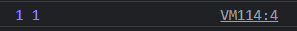

두 변수는 같은 값을 같게 되는데, 

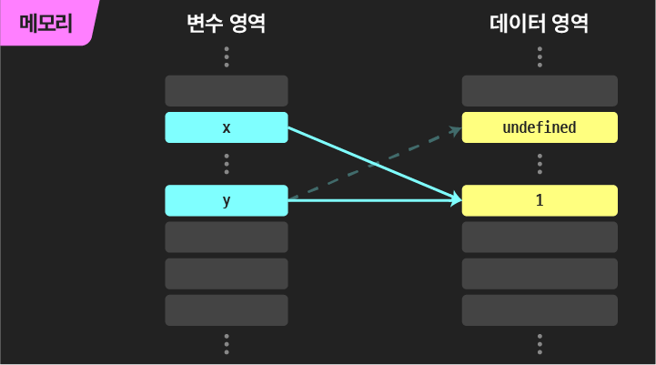

같은 값이므로 메모리 절약을 위해 같은 데이터 영역에 저장된다.


##### 4. x에 1을 넣은 뒤, 'hello'로 재할당

```js
let x = 1;
let y = x;
console.log('변경 전', x, y);

x = 'hello';
console.log('변경 후', x, y);
```

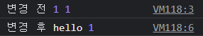

x의 값은 변경 됐지만, y의 값은 그대로인 것을 볼 수 있다. 왜그럴까?

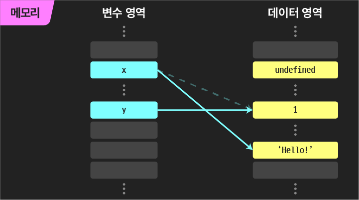

그 이유는, 위에서 한번 설명했듯이 위 이미지에 보이는 것 처럼 기존의 위치에 새 값을 넣는 것이 아니라 데이터영역에서 메모리상 가리키는 위치만 변경 되기 때문이다. y는 아직 1을 가리키고 있기 때문에 변하지 않는다. 만약 y도 변경시키고 싶다면, 재할당을 해줘야 한다.


##### 5. 재선언이 불가능

```javascript
let x = 1;
console.log('첫 선언', x);

let x = 2;
console.log('재선언', x);
```

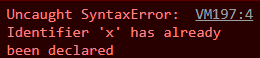

기존에 var는 재선언, 재할당이 모두 가능했지만 let은 불가능하다. 오류문만 해석해봐도 무슨 의미인지 알 수 있다.

브라우저 콘솔에서는 독립적으로 실행할 때 재선언이 가능하긴 한데, 이는 특수케이스이니 불가능한 것으로 알고 있자.


##### 6. 아직 선언하지 않은 변수를 사용할 수 없다

```javascript
console.log(x);
let x = '찍힐까?';
```

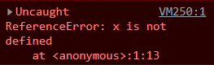


### 상수(*constant*)

- 담긴 값이 바뀔수 없는 데이터 주머니이다. `const`를 사용
- `재할당`, `재선언` 모두 불가능하다!

##### 1. 선언하기만 하는 것은 불가, 선언과 동시에 값을 할당

```javascript
const X;
X = 3.14;
```

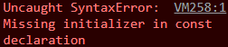

```javascript
const X = '8월 30일';
console.log('내 생일:', X)
```

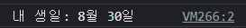

##### 2. 상수는 재선언 및 재할당 모두 불가

```javascript
const X = '8월 30일';
const X = '6월 6일'
```

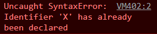

```js
const X = '8월 30일';
X = '6월 6일'
```

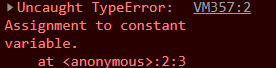


#### 💡 변수, 상수를 동시에 여러개 선언 하는 법

```javascript
// let a = 1;
// let b = 2;
// 위 처럼 해도 상관 없음.

let a = 1, b = 2, c = 3;
const X = 4, Y = 5, Z = 6;

console.log(a, b, c);
console.log(X, Y, Z);
```

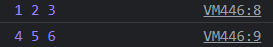


[참고] [얄코 자바스크립트 section1 - lesson3](https://www.yalco.kr/@javascript/1-3/)