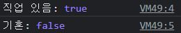
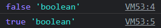
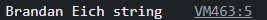
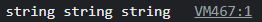
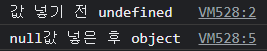
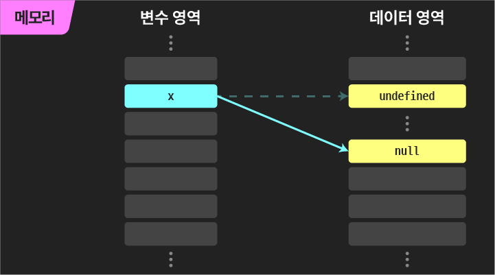
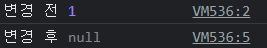
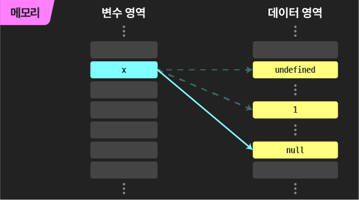

 오늘은 자바스크립트의 자료형 즉 데이터 타입은 무엇이 있는지 알아보고, 그 중에서도 원시타입에 대해서 알아보겠다.


### 데이터 타입

| 원시 타입(원시 자료형)               | 참조 타입(참조 자료형)               |
| ------------------------------------ | ------------------------------------ |
| 객체가 아닌 기본 타입                | 객체 타입의 자료형                   |
| 변수에 해당 타입의 값이 담김         | 변수의 해당 객체의 참조 값이 담김    |
| 다른 변수에 복사할 때 실제 값이 복사 | 다른 변수에 복사할 때 참조 값이 복사 |

 데이터는 위에 표처럼 원시타입과 참조 타입으로 나눌 수 있는데, 참조 타입은 나중에 다시 알아보도록 하고 오늘은 `원시 타입`에는 어떤 것들이 있는지 살펴보자.


#### 원시타입

> 일단 쉽게 표현하자면, 담백하게 값 하나만 담는 단순 자료형이다.

```js
// 예를 들면
const a = true, b = 123.45, c = '안녕하세요!';
```

콘솔에서 값이 어떤 자료형을 갖고있는지 확인하기 위해 **`typeof` 연산자**를 활용할 것이다.

**`typeof` 연산자: 뒤에 오는 값의 자료형을 *return*** 

##### 1. Boolean(불리언)

```javascript
let isEmployed = true;
let isMarried = false;

console.log('직업 있음:', isEmployed);
console.log('기혼:', isMarried);
```



- 논리적 참("기다") 또는 거짓("아니다")을 나타내는 타입
- true(파이썬과 달리 첫글자가 소문자) 또는 false로 표현 - **상반된 둘 중 하나**의 값을 담을 수 있음
- 직접 할당되기보다는 반환값으로 프로그램 곳곳에서 활용됨
- 조건문 또는 반복문에서 유용하게 사용하는데, boolean이 아닌 데이터 타입들은 자동 형변환 규칙에 따라 true 또는 false로 변환

```javascript
const a = 1 > 2;
const b = 1 < 2;

console.log(a, typeof a);
console.log(b, typeof b);
```



| 데이터 타입 | 거짓       | 참               |
| ----------- | ---------- | ---------------- |
| undefined   | 항상 거짓  |                  |
| null        | 항상 거짓  |                  |
| number      | 0, -0, NaN | 나머지 모든 경우 |
| string      | 빈 문자열  | 나머지 모든 경우 |
| object      |            | 항상 참          |


##### 2. 숫자(Number) 타입

- 정수, 실수 구분 없이 모두 숫자 타입
- 부동 소수점 형식을 따름
- NaN(Not-A-Number)
  - 계산 불가능한 경우 반환되는 값이나, 숫자 타입이다.
- 정수는 `2^53 - 1`까지 안정적으로 표현 가능 - *더 큰 정수는 이후에 BigInt를 배우면서 알아보자.*

```javascript
const a = 13 // 양의 정수
const b = -5 // 음의 정수
const c = 3.14 // 실수
const d = 2.998e8 // 거듭제곱
const f = Infinity // 양의무한대
const g = NaN // 산술 연산 불가
console.log(typeof a, typeof b, typeof c, typeof d, typeof f, typeof g)
```

 


##### 3. 문자열(String) 타입

- 큰따옴표, 작은따옴표, 또는 백틱으로 둘러싸인 텍스트 데이터

- 16비트 유니코드 문자의 집합 - 전 세계의 모든 문자표현이 가능하다.
- 템플릿 리터럴(Template Literal)
  - ES6부터 지원, 따옴표 대신 ``(백틱)으로 표현
  - ${expression} 형태로 표현식 삽입 가능

```javascript
const firstName = 'Brandan'
const lastName = 'Eich'
const fullName = `${firstName} ${lastName}`

console.log(fullName, typeof fullName)
```



한가지 재미있는 사실은, typeof의 리턴값도 문자열이다.

```javascript
console.log(
  typeof (typeof true),
  typeof (typeof 123.45),
  typeof (typeof 'Hello'),
);
```




##### 4. undefined

- 변수에 부여된 값이 없음을 나타내는 데이터 타입이지만, JS에서는 undefined 자체도 하나의 값이라는 것이 특징이다.

- 변수 선언 이후 직접 값을 할당하지 않으면, 자동으로 undefined가 할당됨
- typeof 연산자의 결과 `undefined`

```javascript
let firstName
console.log(firstName)
```


그래서 보통 아무것도 반환하지 않는 구문은 undefined를 반환하는데, console.log도 실은 아무것도 반환하지 않는 구문이기 때문에 항상 뒤에 undefined가 찍히는 것을 볼 수 있을 것이다.

##### 5. null

- 변수의 값이 없음을 `의도적`으로 표현할 때 사용하는 데이터 타입이나 null 역시 *"비어있음"이라는 의미를 갖는 하나의 값*이다.
- `object`(객체) 등이 들어있거나 반환되어야 하지만 없을 때 주로 사용한다.
  - *"있어봐, 뭐 들어올 자리야"* / *"뭘 줘야 되는 거 아는데 줄 게 없어"*
  - 객체 생성이 실패한 경우 등에 대신 반환
- undefined와 마찬가지로 변수의 값이 없음을 나타내지만, typeof 연산자의 결과는 `객체(object)`로 표현된다. 객체 자체는 원시타입이 아니므로 이는 오류이다만 수정할 수 없어서 그대로 사용한다.

```javascript
let x;
console.log('값 넣기 전', typeof x);

x = null;
console.log('null값 넣은 후', typeof x);
```





```javascript
let x = 1;
console.log('변경 전', x);

x = null;
console.log('변경 후', x);
```





```javascript
// null 여부는 아래와 같이 확인할 수 있다.
console.log(x === null);
```


[참고] [얄코 자바스크립트 section2 - lesson1](https://www.yalco.kr/@javascript/2-1/)