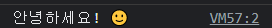
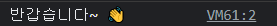
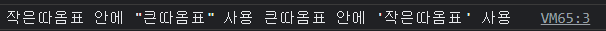
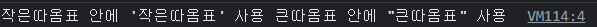
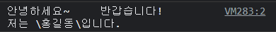
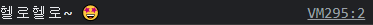
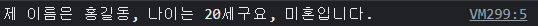

 이번 시간에는 JS에서 **텍스트 데이터**를 담당하는 **문자열**에 대해 자세히 알아보는 시간을 갖겠다.


### 문자열

> 큰따옴표, 작은따옴표, 또는 백틱으로 둘러싸인 텍스트 데이터


#### I. 기본 표기방법

문자열은 위에서 설명한 대로 큰따옴표, 작은따옴표, 그리고 백틱으로 표기할 수 있다.

- ##### 작은따옴표 ' ~'

```js
let word = '안녕하세요! 🙂';
console.log(word);
```



- ##### 큰따옴표 "~"

```javascript
let word = "반갑습니다~ 👋";
console.log(word);
```



그렇다면 문자열 안에서 따옴표를 표시할 때는 어떻게 할까?

##### 💡 문자열 안에 따옴표 사용

큰따옴표를 쓰고 싶을때는, 작은따옴표 안에 사용하고 작은따옴표는 그 반대로 사용한다.

```js
let word1 = '작은따옴표 안에 "큰따옴표" 사용';
let word2 = "큰따옴표 안에 '작은따옴표' 사용";
console.log(word1, word2);
```



작은따옴표 안에 작은따옴표를 사용하면 에러가 발생하고, 만약 사용하고 싶다면 **이스케이프 표현식**을 사용한다.

```js
// ⭐️ 이스케이프 표현(escape sequence)
let word1 = '작은따옴표 안에 \'작은따옴표\' 사용';
let word2 = "큰따옴표 안에 \"큰따옴표\" 사용";
console.log(word1, word2);
```



📌 **자주 사용되는 이스케이프 표현**은 다음과 같다.

| 이스케이프 표현 | 대체       |
| --------------- | ---------- |
| \'              | 작은따옴표 |
| \"              | 큰따옴표   |
| \n              | 줄바꿈     |
| \t              | 탭         |
| \\              | 백슬래시   |

```js
let word = '안녕하세요~\t\t반갑습니다!\n저는 \\홍길동\\입니다.';
console.log(word);
```




#### II. 백틱 - ``

```js
let word = `헬로헬로~ 🤩`;
console.log(word);
```



##### 템플릿 리터럴

- `${}`안에 상수나 변수, 표현식 등을 삽입 가능
- **다른 자료형**도 사용할 수 있음

```js
const NAME = '홍길동';
let age = 20;
let married = false;

console.log(
`제 이름은 ${NAME}, 나이는 ${age}세구요, \
${married ? '기혼' : '미혼'}입니다.`
);
```




[참고] [얄코 자바스크립트 section2 - lesson3](https://www.yalco.kr/@javascript/2-3/)