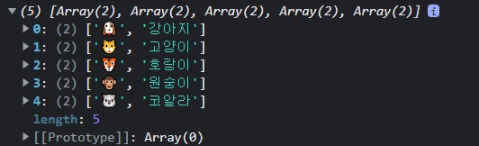
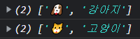
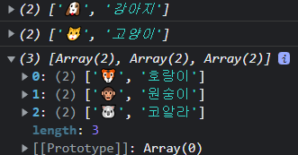

**Map** 객체는 **ECMAScript 6**부터 도입된 JavaScript 객체다. **Map** 객체는 **[키, 값]** 형태의 값을 가지는 객체인데, 이번 포스팅에서는 Map 객체에 대해 알아보겠다.


### **Map 객체**

> 키와 값의 쌍으로 이루어진 컬렉션으로, 키-값 쌍의 삽입순서를 기억하므로 이터러블 하고, **객체 및 원시값이 모두 키 또는 값**으로 사용될 수 있다.

#### 💡 객체와의 차이:

- 이터러블의 일종 (이터러블의 기능 사용 가능)
- 메서드와 프로퍼티 등의 기능 차이
- ⭐️ 객체나 배열 등의 **참조값**을 키로 사용 가능 ⭐️
- ⭐️ 키와 값을 보다 자주 변경하는 경우 적합하도록 설계됨 ⭐️


#### I. 기본 사용법

##### 1. Map 생성

```js
const map1 = new Map();

// [키, 값] 형태의 중첩 배열을 전달하여 Map 객체를 생성하는 방법
const map2 = new Map([
  ['A', 'valueA'],
  ['B', 'valueB'],
  ['C', 'valueC']
]);

console.log(map2); 
//Map(3) {'A' => 'valueA', 'B' => 'valueB', 'C' => 'valueC'}

// 중첩 배열인 변수를 전달하여 Map 객체 생성 가능하며, 
// 만약 중복되는 값이 있다면 Map객체는 오로지 1개의 키만 갖기 때문에 마지막 값만 적용된다. 
const arr = [
  ['A', 'valueA'],
  ['B', 'valueB'],
  ['C', 'valueC'],
  ['B', 'valueBBB'],
]
const map3 = new Map(arr)
console.log(map3)
//Map(3) {'A' => 'valueA', 'B' => 'valueBBB', 'C' => 'valueC'}

// [[키, 쌍]...] 배열로 생성
const map4 = new Map([
  ['x', 1],
  [123, 'ABC'],
  [true, { a: 1, b: 2 }],
]);

console.log(map4); 
//Map(3) {'x' => 1, 123 => 'ABC', true => {…}}
```


##### 2. Map 객체 메서드

- `size` 메서드
  - **Map** 객체 요소의 개수를 구할 수 있다.

```js
const arr = [
  ['A', 'valueA'],
  ['B', 'valueB'],
  ['C', 'valueC']
]
const map3 = new Map(arr)
console.log(map3.size) // 3
```

- `set` 메서드
  - 키와 값의 쌍을 추가하거나, 기존에 키에 매핑된 값을 변경할 수 있다.
  - 위에서 이야기 했듯, 키의 중복을 불허하기 때문에 기존에 키가 존재한다면 값을 덮어씌운다.
  - **메서드 체이닝**을 사용하여 set함수를 연결할 수 있다.

```js
const map1 = new Map();

map1.set('x', 1);
map1.set(123, 'ABC');
map1.set(true, { a: 1, b: 2 });
map1.set(999, "qqq").set(666, "bbb");

console.log(map1);
//Map(5) {'x' => 1, 123 => 'ABC', true => {…}, 999 => 'qqq', 666 => 'bbb'}
```

- `has` 메서드
  - 주어진 키에 연관된 값이 `Map` 객체에 존재하는지 여부를 불리언 값으로 반환한다.

```js
console.log (
  map1.has('x'),
  map1.has('y')
); //true false
```

- `get` 메서드
  - 주어진 키에 해당하는 값을 반환
  - 값이 없다면 `undefined`을 반환

```js
// get 메서드 - 값에 접근
console.log(
  map1.get('x'),
  map1.get(123),
  map1.get(true),

  // 없는 키로 접근시
  map1.get('y')
);
// 1 'ABC' {a: 1, b: 2} undefined
```

- `delete` 메서드
  - `Map` 객체에 해당 요소가 존재하여 삭제가 성공하면 `true`를 반환 
  - 삭제할 요소가 존재하지 않는다면 `false`를 반환
  - 이 이후에 `map.has(key)`를 실행하면 `false`를 반환

```js
console.log(map1.delete('x')); // true
console.log(map1.delete('y')); // false

console.log(map1.has('x')); // false
```

- `clear` 메서드
  - 모든 값 삭제

```js
map1.clear()
console.log(map1) // Map(0) {size: 0}
```


- `keys`, `values`, `entries` 메서드
  - 각각 키 / 값 / [키, 값] 반환

```js
console.log(
  map2.keys(),
  map2.values(),
  map2.entries()
);
// MapIterator {'x', 123, true} MapIterator {1, 'ABC', {…}} MapIterator {'x' => 1, 123 => 'ABC', true => {…}}
```


#### II. 이터러블로서의 Map

```js
const arr = [
  ['🐶', '강아지'],
  ['🐱', '고양이'],
  ['🐯', '호랑이'],
  ['🐵', '원숭이'],
  ['🐨', '코알라']
];
const map = new Map(arr);
```

##### 1. `for ... of` 문

```js
for (let [key, value] of map) {
	console.log(key, value);
}
/*
🐶 강아지
🐱 고양이
🐯 호랑이
🐵 원숭이
🐨 코알라
*/

// obj에서 위와 똑같이 키, 값에 접근할 때는 인덱스를 통해 접근 가능
for (let obj of map) {
	console.log(obj[0], obj[1]);
}
```

##### 2. 스프레드 문법

```js
const newArr = [...map];
console.log(newArr);
```



##### 3. 디스트럭쳐링

```js
const [x, y] = map;
console.log(x);
console.log(y);
```



```js
const [a, b, ...rest] = map;
console.log(a);
console.log(b);
console.log(rest);
```




#### 💡 이터러블과 별개 - `forEach` 메서드도 사용 가능

```
map.forEach(console.log);
// 아래의 결과와 같음
// map.forEach((item, idx, set) => { console.log(item, idx, set)});
```
