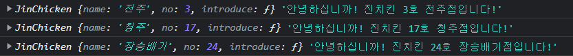
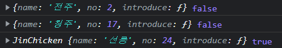
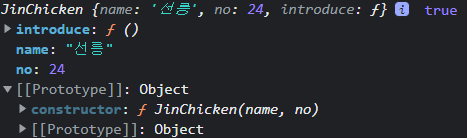

 객체를 생성하는 가장 기본적인 방법은 `객체 리터럴`을 통한 것이다. 근데 막상 코딩을 하다보면, 같은 형태를 지닌 많은 객체들을 생성해야 하는 경우가 있는데 이는 너무 비효율적으로 느껴진다. 그렇다면 <u>그냥 객체자체를 반환해 주는 함수를 쓰면 되지 않을까</u>? 라는 생각이 들기도 하는데, 사실 더 쉬운 방법은 `new`연산자와`생성자 함수`를 사용하는 것이다. 오늘은 `생성자 함수`는 무엇이며, 과연 일반적인 객체 리터럴이나 객체를 반환해주는 함수와의 차이는 무엇이 있는지 알아보자.


### **생성자 함수**

> 생성자 함수는 객체를 생성하기 위해 사용되는 함수인데, 여기서 만들어진 객체를 `인스턴스`라고 한다.  사실 일반 함수와 기술적인 차이가 없다만 생성자 함수는 일반 함수와 달리 두가지 지켜주어야 할 사항이 있다.
>
> 1. 대문자로 시작하며
> 2. 반드시 `new`연산자를 붙여 실행한다

#### 💡 생성자 함수 특징

1. `this.~`로 생성될 인스턴스의 프로퍼티들을 정의한다.
2. 생성자 함수를 직접 만들어보면, 반환값이 따로 없지만 암묵적으로 this를 반환한다고 생각하면 된다.
3. 생성자 함수에서는 메서드를 정의할 수 없다(객체 리터럴이나 클래스에서는 가능)


#### I. 기본 사용법

```js
// 생성자 함수 
function JinChicken (name, no) {
  this.name = name;
  this.no = no;
  this.introduce = function () {
    return `안녕하십니까! 진치킨 ${this.no}호 ${this.name}점입니다!`;
  }
}

// 인스턴스 생성
const chain1 = new JinChicken('전주', 3);
const chain2 = new JinChicken('청주', 17);
const chain3 = new JinChicken('장승배기', 24);

console.log(chain1, chain1.introduce());
console.log(chain2, chain2.introduce());
console.log(chain3, chain3.introduce());
```




##### ⚠️ 여기서 주의할 점은 앞에서도 이야기 했지만`new`를 붙이지 않으면 `undefined` 반환

```js
function JinChicken (name, no) {
  this.name = name;
  this.no = no;
  this.introduce = function () {
    return `안녕하십니까! 진치킨 ${this.no}호 ${this.name}점입니다!`;
  }
}

const chain1 = JinChicken('전북대', 31); //undefined
```


##### 💡그렇다면, 객체 리터럴 혹은 객체를 반환하는 함수와의 차이는 무엇일까?

```js
// 생성자 함수 
function JinChicken (name, no) {
  this.name = name;
  this.no = no;
  this.introduce = function () {
    return `안녕하십니까! 진치킨 ${this.no}호 ${this.name}점입니다!`;
  }
}

// 객체를 반환하는 함수
function createJinChicken (name, no) {
  return {
    name, no,
    introduce () {
      return `안녕하세요, ${this.no}호 ${this.name}점입니다!`;
    }
  }
}

// 객체 리터럴
const chain1 = {
  name: '전주', no: 2,
  introduce: function () {
    return `안녕하세요, ${this.no}호 ${this.name}점입니다!`;
  }
};

// 객체 반환 함수
const chain2 = createJinChicken('청주', 17);

// 생성자 함수
const chain3 = new JinChicken('선릉', 24);

console.log(chain1, chain1 instanceof JinChicken);
console.log(chain2, chain2 instanceof JinChicken);
console.log(chain3, chain3 instanceof JinChicken);
```

일단 첫번째로,



객체 자체의 로그가 다른 것을 알 수 있다. **생성자 함수로 만든 객체는 앞에 생성자 함수명이 붙는다.**

두번째로, 객체가 특정 생성자 함수에 의해 만들어졌는지 여부를 반환 하는 `instanceof` 메서드를 사용하면, 당연하게도 생성자 함수에 의해 만들어진 인스턴스인 세번째만 true를 반환한다.

마지막은



콘솔에서 `[[Prototype]]`을 펼쳐서 확인 해보면, constructor의 체인이 해당 생성자 함수 포함하는지 여부가 다르다.

