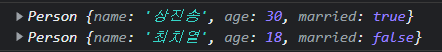

 지난번 포스팅에서 `생성자 함수`에 대해 알아보았다. 자바스크립트에서의 객체지향 방식은 `생성자 함수`와 `프로토타입`을 사용하는 방법인데, 이는 다른 언어들과 좀 다르고 생소하기 때문에 다른 언어들과 비슷한 문법인 `클래스` 문법을 만들었다. 

`클래스`는 JS에서 생성자함수와 프로토타입의 **Syntactic Sugar** (문법을 보다 읽기 쉽게 만드는 것)라고도 한다. 오늘 포스팅에서는 지난시간 생성자 함수를 통해 만들었던 인스턴스를 <u>`클래스`를 통해 만드는 법</u>을 알아보겠다.


### **클래스** *class*를 사용하여 인스턴스 만들기

```js
class JinChicken {
    constructor (name, no) {
        this.name = name;
        this.no = no;
    }
    introduce () {
        return `안녕하세요!! ${this.no}호 ${this.name}지점입니다!`
    }
}

const chain1 = new JinChicken('전주', 3);
const chain2 = new JinChicken('청주', 17);
const chain3 = new JinChicken('대전', 24);

console.log(chain1, chain1.introduce());
console.log(chain2, chain2.introduce());
console.log(chain3, chain3.introduce());
```


콘솔을 찍어보면, 지난 생성자 함수와 마찬가지로 클래스의 이름이 나오고, 똑같이 인스턴스가 생성된 것을 확인할 수 있다. 다만 다른점이 있다면 프로토타입을 펼쳤을 때 나오는 constructor에 생성자 함수가 아닌 `클래스`로 보인다는 것이다.

##### ⚠️ 생성자 함수와 클래스 모두 인스턴스를 똑같이 생성하지만, 차이점이 존재!

```js
// 차이 1. 함수는 함수를 늦게 선언해도 사용 가능 하지만,, 클래스는 호이스팅되지 않는다..
const chain1 = new JinChicken('판교', 3);

class JinChicken {
  constructor (name, no) {
    this.name = name;
    this.no = no;
  }
  introduce () {
     return `안녕하세요!! ${this.no}호 ${this.name}지점입니다!`
  }
}

// 차이 2. 생성자 함수는 new없이 사용하면 오류 없이 undefined를 반환했다면, 클래스는 new 없이 사용하면 오류가 난다.
const chain2 = YalcoChicken('강남', 17);
```


클래스를 살펴보면, 생성자 함수가 하는 역할을 대신 해주는 듯 보이는 녀석이 있다. 바로 `constructor`인데, 다음으로 `constructor`메서드에 대해 알아보자.


#### `constructor` 메서드

이 메서드에는 다음과 같은 특징이 있다.

- 인스턴스 생성시 인자를 받아 프로퍼티를 초기화함
- 클래스에 **하나만** 있을 수 있음 - *초과시 오류 발생*
- 다른 메서드 이름을 쓸 수 없음(무조건 constructor! )
- 기본값 사용 가능

```js
class Person {
  constructor (name, age, married = false) {
    this.name = name;
    this.age = age;
    this.married = married;
  }
}

const person1 = new Person('상진송', 30, true);
const person2 = new Person('최치열', 18);
console.log(person1, person2);
```



- 필요없을 *(인자가 없을 때 등)* 시 생략 가능

```js
// 인스턴스 초기화가 필요없는 클래스
class Empty {}
console.log(new Empty());
```


- ⚠️ 값을 반환하지 말 것! *생성자 함수처럼 암묵적으로 this 반환*

