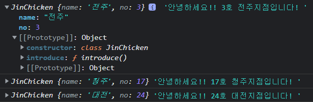

 지난번 포스팅에서 `생성자 함수`에 대해 알아보았다. 자바스크립트에서의 객체지향 방식은 `생성자 함수`와 `프로토타입`을 사용하는 방법인데, 이는 다른 언어들과 좀 다르고 생소하기 때문에 다른 언어들과 비슷한 문법인 `클래스` 문법을 만들었다. 

`클래스`는 JS에서 생성자함수와 프로토타입의 **Syntactic Sugar** (문법을 보다 읽기 쉽게 만드는 것)라고도 한다. 오늘 포스팅에서는 지난시간 생성자 함수를 통해 만들었던 인스턴스를 <u>`클래스`를 통해 만드는 법</u>을 알아보겠다.


### **클래스** *class*를 사용하여 인스턴스 만들기

```js
class JinChicken {
    constructor (name, no) {
        this.name = name;
        this.no = no;
    }
    introduce () {
        return `안녕하세요!! ${this.no}호 ${this.name}지점입니다!`
    }
}

const chain1 = new JinChicken('전주', 3);
const chain2 = new JinChicken('청주', 17);
const chain3 = new JinChicken('대전', 24);

console.log(chain1, chain1.introduce());
console.log(chain2, chain2.introduce());
console.log(chain3, chain3.introduce());
```



콘솔을 찍어보면, 지난 생성자 함수와 마찬가지로 클래스의 이름이 나오고, 똑같이 인스턴스가 생성된 것을 확인할 수 있다. 다만 다른점이 있다면 프로토타입을 펼쳤을 때 나오는 constructor에 생성자 함수가 아닌 `클래스`로 보인다는 것이다.

##### ⚠️ 생성자 함수와 클래스 모두 인스턴스를 똑같이 생성하지만, 차이점이 존재!

```js
// 차이 1. 함수는 함수를 늦게 선언해도 사용 가능 하지만,, 클래스는 호이스팅되지 않는다..
const chain1 = new JinChicken('판교', 3);

class JinChicken {
  constructor (name, no) {
    this.name = name;
    this.no = no;
  }
  introduce () {
     return `안녕하세요!! ${this.no}호 ${this.name}지점입니다!`
  }
}

// 차이 2. 생성자 함수는 new없이 사용하면 오류 없이 undefined를 반환했다면, 클래스는 new 없이 사용하면 오류가 난다.
const chain2 = YalcoChicken('강남', 17);
```


클래스를 살펴보면, 생성자 함수가 하는 역할을 대신 해주는 듯 보이는 녀석이 있다. 바로 `constructor`인데, 다음으로 `constructor`메서드에 대해 알아보자.


#### `constructor` 메서드

이 메서드에는 다음과 같은 특징이 있다.

1. 인스턴스 생성시 인자를 받아 프로퍼티를 초기화함
2. 클래스에 **하나만** 있을 수 있음 - *초과시 오류 발생*
3. 다른 메서드 이름을 쓸 수 없음(무조건 constructor! )
4. 기본값 사용 가능

```js
class Person {
  constructor (name, age, married = false) {
    this.name = name;
    this.age = age;
    this.married = married;
  }
}

const person1 = new Person('상진송', 30, true);
const person2 = new Person('최치열', 18);
console.log(person1, person2);
```


5. 필요없을 *(인자가 없을 때 등)* 시 생략 가능

```js
// 인스턴스 초기화가 필요없는 클래스
class Empty {}
console.log(new Empty());
```


6. ⚠️ 값을 반환하지 말 것! *생성자 함수처럼 암묵적으로 this 반환*


#### 클래스에서의 메서드

```js
class Person {
	greeting () {
        return '안녕하세요'
    }
}
const person1 = new Person()
console.log(person1, person1.greeting())
```


지난 포스팅에서, 생성자 함수에서는 메서드를 정의할 수 없다고 했는데, 그렇다면 생성자 함수에 들어가있는 함수와 클래스에서의 메서드와의 차이는 무엇일까? 직접 비교해보자.

```js
function Person2 () {
	this.greeting = function () {
        return '안녕하세요'
    }
}
const person1 = new Person2()
console.log(person1, person1.greeting())
```


클래스 메서드는 **프로토타입**으로 들어가있는 것을 볼 수 있고, 생성자함수에 들어가 있는 함수는 그렇지 않다.


#### 🧪 **필드** *field*

> - `constructor` 메서드 밖에서, `this.~` 없이 인스턴스의 프로퍼티 정의하는 것

```js
class Fighter {
	hp = 100
	op = 10
    punch (e) {
        e.hp -= this.op
        this.hp += this.op/2
    }
}

const fighter1 = new Fighter()
const fighter2 = new Fighter()

console.log(fighter1, fighter2)
```


```js
fighter1.punch(fighter2)
console.log(fighter1, fighter2)
```


```js
class JinChicken {
  no = 0;
  menu = { 
      '후라이드 치킨' : 10000, 
      '양념 치킨' : 12000,
      '순살 치킨' : 12000
  };

  constructor (name, no) {
    this.name = name;
    if (no) this.no = no;
  }
  introduce () {
    return `안녕하세요!! ${this.no}호 ${this.name}지점입니다!`
  }
  order (name) {
    return `${this.menu[name]}원입니다.`
  }
}

const chain0 = new JinChicken('미정')
console.log(chain0, chain0.introduce(), chain0.order('순살 치킨'))
```


new 생성자를 통해 새롭게 만들어진 인스턴스들은 각자의 저장공간을 갖기 때문에 다음과 같이 변경해줄 수 있다.

```js
const chain1 = new JinChicken('전주', 1)
chain1.menu['순살 치킨'] = 14000
console.log(chain0.order('순살 치킨'), chain1.order('순살 치킨'))
```


#### **정적** *static* 필드와 메서드

> 인스턴스의 수와 관계없이 메모리를 한곳만 차지하여, 클래스 차원에서 호출하는 필드 및 메서드이다. 정적메서드는 정적 필드만 사용가능하며, static을 붙여서 표현한다.

```js
class JinChicken {

  // 정적 변수와 메서드
  static brand = '진 치킨';
  static contact () {
    return `${this.brand}입니다. 무엇을 도와드릴까요?`;
  }

  constructor (name, no) {
    this.name = name;
    this.no = no;
  }
  introduce () {
    return `안녕하세요, ${this.no}호 ${this.name}점입니다!`;
  }
}

console.log(JinChicken);
console.log(JinChicken.contact());
```


💡 마지막으로, 클래스를 typeof 해보면 **function**인 것을 확인할 수 있다. 이는 함수의 기능을 똑같이 클래스가 담당한다는 의미로, 클래스는 **일급객체**이며 함수와 마찬가지로 **다른곳에서 할당이 가능**하다는 의미이다.

```js
class Dog {
  bark () {
    return '멍멍';
  }
}

console.log(typeof Dog); //function
```

```js
const 개 = Dog; // 할당될 수 있는 일급 객체
const 바둑이 = new 개();

console.log(바둑이); // 💡 콘솔에 나타난 타입 확인
```

