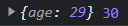
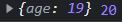
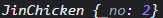

 객체에서 **프로퍼티에 접근할 때 메서드 역할을 하지만 일반 프로퍼티와 같게 접근할 수 있는 프로퍼티**를 `접근자 프로퍼티`라고 한다. 오늘은 `접근자 프로퍼티`에 대해서 포스팅해보겠다. 

#### 프로퍼티의 종류

> 프로퍼티는 크게 데이터 프로퍼티와 접근자 프로퍼티로 나뉜다.

- 데이터 프로퍼티(data property) : 일반적으로 사용하는 값을 저장하기 위한 프로퍼티. 
- 접근자 프로퍼티(accessor property) : 스스로는 값을 갖지 않음. **다른 프로퍼티의 값을 읽거나 저장**할 때 사용. 접근자 프로퍼티의 본질은 함수이며, 이 함수는 값을 `획득(get)`하고 `설정(set)`하는 역할을 담당하고, `get`, `set`을 앞에 붙여 사용

```js
const person1 = {
  age: 29,

  get koreanAge () {
    //getter(획득자) 이며, person1.koreanAge를 실행할때 실행되는 코드로 반드시 return 값이 존재
      return this.age + 1
  },

  set koreanAge (value) {
    //setter(설정자) 이며, person1.koreanAge = value를 실행할 때 실행되는 코드
      this.age = value - 1
  }
}
```

정리하면,

- getter 메서드는 person1.koreanAge을 사용해 프로퍼티를 읽으려고 할 때 실행, 반드시 값을 반환해야 하며 특정 프로퍼티(들)를 원하는 방식으로 가공하여 내보낼 때 사용
- setter 메서드는 person1.koreanAge = value 로 프로퍼티에 값을 할당하려 할 때 실행, 하나의 안자를 받으며 특정 프로퍼티에 값이 저장되는 방식을 조작하거나 제한하는데 사용

```js
console.log(person1, person1.koreanAge);
```



```js
person1.koreanAge = 20;
console.log(person1, person1.koreanAge);
```



#### ⭐️ 클래스에서 사용

```javascript
class JinChicken {
  constructor (name, no) {
    this.name = name;
    this.no = no;
  }
  get chainTitle() {
    return `${this.no}호 ${this.name}점`;
  }
  set chainNo(chainNo) {
    if (typeof chainNo !== 'number') return;
    if (chainNo <= 0) return;
    this.no = chainNo;
  }
}
```

- 전주 2호점 인스턴스를 만들고, 체인점 이름 출력하기

```js
const chain1 = new JinChicken('전주', 2);
console.log(chain1.chainTitle); //2호 전주점
```

- 전주점이 알고보니 3호점이라 3호점으로 바꿔주기

```js
chain1.chainNo = 3
console.log(chain1.chainTitle) //3호 전주점
```


다만 클래스에서 사용할 때 주의할 점이 한가지 있는데, 바로 **필드 이름과 setter의 이름이 같을 때**이다. 

```js
class JinChicken {
  constructor (no) {
    this.no = no;
  }
  set no (no) { 
    this.no = no;
  }
}
const chain1 = new JinChicken('전주', 2); 
```

다음 처럼 클래스를 작성하면, 오류가 발생하는데 그 이유는 필드의 no와 setter에서의 no가 계속 무한반복 되기 때문이다. 따라서 이를 해결하기 위해서는

```js
class JinChicken {
  constructor (no) {
    this.no = no;
  }
  set no (no) { 
    this._no = no;
  }
}
const chain1 = new JinChicken(2); 
```

setter와는 다른 필드명을 사용하도록 하는 것이다. 위의 경우에 실제 필드명은



사진에서 보이는 것 처럼 `_no` 가 된다.
