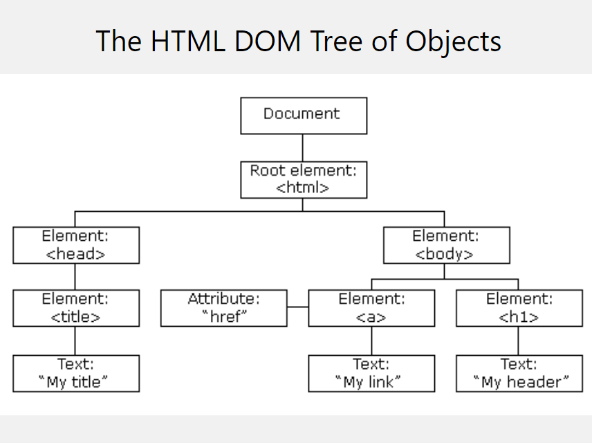

 React를 공부할 때 나오는 개념 중 하나인 Virtual DOM. 사실 JS를 공부하면서 DOM에 대해 먼저 공부하게 되지만, 개발을 진행하다 보면 DOM이라던지 Virtual DOM에 대한 개념적인 부분은 약해질 수 밖에 없는 것 같다. 그래서 오늘은 Virtual DOM에 대해 포스팅하겠다.


### DOM 이란?

 Virtual DOM에 대해 설명하기 전에, 우선 DOM에 대해 알아야겠다.

>[DOM](https://developer.mozilla.org/ko/docs/Web/API/Document_Object_Model/Introduction) (The Document Object Model, 문서객체모델) 은 **HTML / XML 문서에 접근하기 위한 인터페이스**이다. 브라우저는 HTML 문서를 파싱하여 사용자에게 시각화해 준다. 이때 우리는 여러 가지 이유로 브라우저가 띄워주는 **HTML 문서에 어떤 동적인 처리를 해 주고 싶을때가 있는데, 그 과정을 도와주는 인터페이스가 DOM**이다. 대표적인 DOM 규격 중 하나인 W3C DOM의 [API DOC](https://dom.spec.whatwg.org/#interface-document) 을 보면 우리가 흔히 아는 `getElementsByTagName` 과 같은 메소드를 정의하고 있음을 알 수 있다.

**"문서의 구성요소들을 객체로 구조화하여 나타낸 것"**



### DOM을 `조작`하는 법

> JavaScript 는 브라우저에서 Web API를 이용하고 DOM을 조작하기 위해 태어난 언어다. 따라서 DOM을 조작하기 위해서는 JavaScript를 이용한다.

```jsx
// js
function addItem () {
  const value = document.getElementById('input').value;
  const list = document.getElemendById('list');
  const newItem = document.createElement('li');
  const text = document.createTextNode(value);
  
  newItem.appendChild(text);
  list.appendChild(newItem);
}

// html
...
<ul id="list">
  <li>a</li>
  <li>b</li>
</ul>
<input id="input"></input>
<button onclick="addItem">+</button>
...
```

우리는 위와 같이 JavaScript를 통해 DOM을 조작할 수 있다.


### Virtual DOM의 탄생

 Web의 복잡도가 점차 증가함에 따라 DOM 조작도 점점 빈번하게 일어나게 되었다. [브라우저 렌더 과정](https://d2.naver.com/helloworld/59361) 에 따라 DOM 조작은 브라우저 렌더 과정을 유발(렌더 트리 생성, 페인트 등등)하는데,  3000번의 변화가 생기면 렌더도 3000번 진행할 수 밖에 없었다. 그냥 글로만 썼을 뿐인데도 DOM 조작이 많이 발생할 경우 뭔가 비효율적일 것 같다는 생각이 든다. *Virtual DOM 은 이런 상황을 해결하기 위해 탄생한 것이다.* 그럼 Virtual DOM이 무엇인지 천천히 알아보자.


#### 1. Virtual DOM이란?

"**DOM을 추상화한 하나의 가상 레이어**"

기존의 DOM에는 다음과 같은 문제점이 존재했다.

- **DOM 조작에 의한 렌더링이 비효율적인 문제**
- SPA(Single Page Application)특징으로 **DOM 복잡도 증가에 따른 최적화 및 유지 보수가 더 어려워지는 문제**

결론적으로 **DOM을 반복적으로 직접 조작하면 그 만큼 브라우저가 렌더링을 자주하게 되고, 그 만큼 PC 자원을 많이 소모하게되는 문제**를 해결하기 위한 기술  Virtual DOM이다.

Virtual DOM은 DOM과 유사한 역할을 담당할 객체이다. 즉, **변경 사항을 DOM에 직접 수정하는게 아니라 중간 단계로 Virtual DOM을 수정하고 Virtual DOM을 통해서 DOM을 수정**하게 했다.

실질적인 방법은 **Virtual DOM에 변경 내역을 한 번에 모으고(버퍼링) 실제 DOM과 변경된 Virtual DOM의 차이를 판단한 후, 구성요소의 변경이 부분만 찾아 변경하고 그에 따른 렌더링을 한 번만 하는 것**으로 해결했다.


##### 1-1. 간단히 짚고 넘어가는 브라우저의 렌더링 방법

1. HTML을 파싱하여 **DOM 객체**를 생성하고, CSS를 파싱하여 **스타일 규칙**을 만든다.
2. 이 두개를 합쳐서 실제로 웹 브라우저에 보여져야할 요소를 표현한 **"렌더 트리"** 를 만든다.
3. 이 렌더 트리를 기준으로 **레이아웃을 배치**하고 **색을 칠하는 등의 작업**을 수행한다.


이 과정에서 문제가 되는 경우는 현대의 웹처럼 변경해야할 대상도 많고 변경도 많은 경우다.
프로그래밍에 의해 DOM을 변경해야하고 변경할 구성 요소가 100개면 위의 과정을 100번을 하는 비효율적인 작업을 해왔다.
정확히는 DOM을 변경하는게 문제가 아니고 **렌더링을 여러번 하는게 문제**였는데, Virtual DOM이 등장했다.


##### 2.  Virtual DOM의 한계

- Virtual DOM의 작동 원리는 하나의 레이어를 더 거쳐가는 동작이기 때문에, DOM 조작이 아주 많지 않다면 "당연하게도" DOM을 직접 조작하는 것보다 느리다.

  1. Virtual DOM을 조작하고 -> DOM을 조작하는 것

  2. DOM을 조작하는 것

​		당연히 1번이 더 느릴 수 밖에 없다. 그리고 실제로 DOM 조작은 그리 드라마틱하게 많이 발생하지 않는다. 일반적인 상황에서 3000번의 DOM 조작 같은 건 일어날 일이 없다.

- React나 Vue등을 이용해서 Virtual DOM을 쓰면 무조건 빠른가? → 아니다. 똑같이 최적화를 해야한다. (슬라이드를 옮기거나 무한 스크롤등의 움직임이 있을 때는 Virtual DOM을 이용해서 반복 렌더링을 하지 않도록 해줘야한다.)
- Virtual DOM은 메모리에 존재한다. DOM에 준하는 무거운 객체(Virtual DOM)가 메모리에 상주(?)하고 있기 때문에 메모리의 사용이 많이 늘어날 수 밖에 없다.
- Virtual DOM을 조작하는 것도 엄청나게 많은 컴포넌트를 조작하게 된다면 오버헤드가 생기기 마련이다. Virtual DOM 제어가 DOM 직접 제어에 비해 상대적으로 비용이 적게 들 뿐이다.


### DOM과 Virtual DOM, React

React는 이러한 DOM 엘리먼트를 직접 조작하지 않고 가상 DOM을 생성하여 브라우저가 이를 렌더링하도록 하는 방식을 따른다. 이러한 Virtaul DOM을 React 엘리먼트라고 한다. React 엘리먼트는 개념상 HTML 엘리먼트와 비슷하지만 실제로는 Javascript 객체다. 따라서 HTML의 DOM API를 직접 다루는 것보다 Javascript 객체인 React 엘리먼트를 직접 다루는 편이 훨씬 빠르다.


##### ❗**리액트는 상태값이 변경될 때마다 UI를 자동으로 업데이트해주는 JS 라이브러리다.**

1. 리액트는 **컴포넌트의 1) 상태값이 변경되면, 2) UI를 자동 업데이트** 해주는 라이브러리다.

- 즉, state, props, redux store 등의 상태값이 변경되면,

- 리액트가 해당 컴포넌트 함수를 자동으로 재호출하여 재렌더링 해준다.

 

2. 이 때, **가상DOM(Virtual DOM)**을 통해 **변경된 부분의 UI만 효율적으로 업데이트**한다.

- 가상DOM은 실제DOM을 분석하여 만든 Javascrip 객체이다.

- 컴포넌트의 상태값이 변경되면, 새로운 가상DOM 객체를 만들고, 이전 가상DOM 객체와 비교한다.

-  최종적으로 바뀐 부분이 있을 경우, 해당 부분만 실제 DOM에 반영하여 UI를 업데이트 한다.


##### **❗리액트 UI 업데이트 단계**

**리액트는 아래의 2단계를 통해 상태값 변경에 따른 UI 업데이트를 진행한다.**

**1. 렌더 단계(Render Phase. diffing 이라고도 한다. )**

- 리액트는 렌더링 할 때마다 매번 새로운 가상 DOM 을 만들고,

- 이전 가상DOM과 비교하여 바뀐 부분을 탐색하고,

- 실제 DOM에 반영할 부분을 결정한다.

**2. 커밋 단계(Commit Phase)**

- 렌더 단계를 거쳐 바꾸기로 결정된 부분만 실제 DOM에 반영한다.

- 브라우저는 변경된 실제 DOM을 화면에 paint 한다.

- 이 때가 didMount, didUpdate가 완료되어 useEffect가 호출되는 시점이다.

위의 과정을 **재조정(Reconcilation)** 이라고 부른다.


### 결론

**Virtual DOM은 기존 DOM의 단점을 보완했다. 하지만 항상 DOM보다 Virtual DOM이 빠르고 효과적이지 않다. React는 <u>지속적으로 데이터가 변하는 대규모 어플리케이션에 적합</u>하다고 나와있다. 이 말은 아주 간단한 작업에는 '굳이' 라는 말을 할 수 있다. 경우에 따라 가장 최적한 것을 사용하여 유연하게 개발하는게 가장 뛰어난 개발자인 것 같다.**


[출처] [https://velog.io/@woohm402/virtual-dom-and-react](https://velog.io/@woohm402/virtual-dom-and-react), [https://jeong-pro.tistory.com/210](https://jeong-pro.tistory.com/210), [https://curryyou.tistory.com/484](https://curryyou.tistory.com/484)
